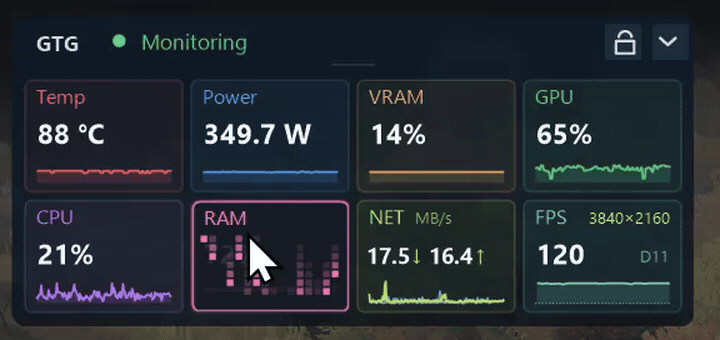
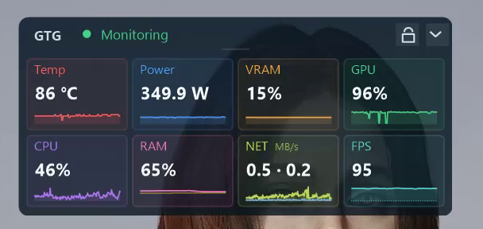
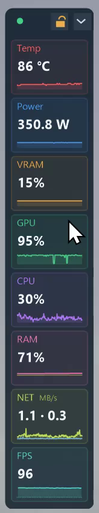
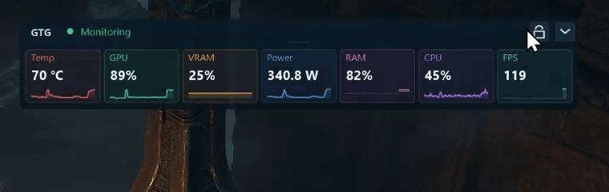
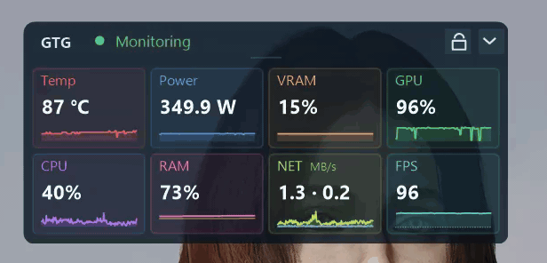
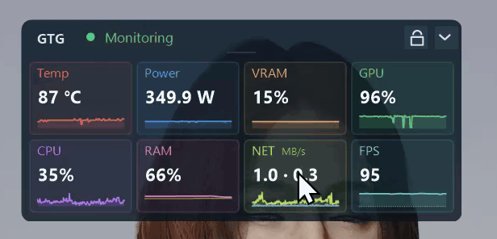

# GpuThermalGuard

English | [繁體中文](README.zh-TW.md)

**A lightweight Windows GPU thermal protection and real-time monitoring utility for NVIDIA GPUs, powered by NVML.**

GpuThermalGuard watches GPU telemetry in real time and applies a preconfigured lower power limit when a dangerous temperature or a rapidly rising thermal trend is detected. It is a small native C++/Win32 application designed to remain useful precisely when GPU stability is in question.

> [!WARNING]
> This is an independent mitigation tool, not an NVIDIA product and not a firmware, driver, cooling, or hardware repair. It cannot guarantee prevention of every TDR. A defective or affected board may still require an official SKU-matched VBIOS update or RMA.

## Screenshots

| Main dashboard, eight history records | Expanded OSD, arranged by the reader |
| --- | --- |
|  |  |

Screenshots show one workstation's settings, not recommended limits for every GPU.

A one-minute walkthrough of this release, recorded over a game at 4K -- the compact dashboard moving between one row, two rows and a single column, host memory being released, and the network and frame rate being read while the game runs -- is on
[YouTube](https://www.youtube.com/watch?v=1urYDlP_he0).



### Compact OSD


Use the chevron in the OSD header to switch between the full charts and compact mode. Compact mode shows each record as a small card with a live value and a 30-second miniature trend. **Show RAM** and **Show FPS** each add a card; unchecking one returns the layout to the records that remain.

By default every enabled record sits on one row, so the OSD grows sideways with the record count rather than getting taller. You can also arrange it into two rows:



Or into a single column, which suits a screen edge:



Protection alerts and telemetry warnings remain visible in the header. Switching views does not pause monitoring or change protection settings. Drag the header outside the buttons to move the OSD; restart returns to the expanded view.

Compact mode is included starting with v0.9.0-beta.2.

### Arranging the compact OSD



Starting with v0.11.0-beta.1 you can rearrange the compact dashboard. The lock control left of the chevron toggles between locked, where the cards ignore the pointer, and unlocked, where they do not. Locked is the resting state and is drawn quietly; unlocked turns amber, because an always-on-top window that accepts drags should say so.

Unlocked, press a card and release it where you want it:

- release it on the same row to reorder,
- release it below the row to move it into a second row,
- release it on the first row to bring it back up.

Any row can hold a single card, so the whole dashboard can be one column. The expanded OSD follows the same order. The arrangement is remembered between runs, and **Reset OSD layout** in the tray menu restores the default.

The lock governs the cards only. The OSD itself still moves by its top bar whether locked or not.

### Optional host RAM

Starting with v0.11.0-beta.1, **Show RAM** is checked by default and adds a host memory record to the dashboard, the expanded OSD and the compact OSD. Physical memory usage is the foreground reading; virtual commit is drawn behind it in a second accent, so you can see both without one competing with the other.

Virtual commit is measured against the system commit limit, which is larger than installed physical memory, so the commit curve normally sits below the physical one. Turning the record off clears its history immediately.

The reading comes from a single `GlobalMemoryStatusEx` call on the existing display tick. It adds no dependency, is never read on the 200 ms protection path, and is not written to the log.

### Releasing host memory



Starting with v0.12.0, double-clicking the RAM card on a locked compact dashboard asks Windows to trim working sets and release the standby list, then reports how much host memory came back. The card animates while the work runs on its own thread -- the animation is not a progress bar, because how long a trim takes is set by the processes being trimmed, and it is there to show that the message loop is not blocked.

Nothing pops up and nothing takes focus, so it is safe to use with a game in front. If the machine moved less than the noise floor, the card says so rather than claiming a gain. The action requires the dashboard to be locked: unlocked is arrange mode, and a drag and an action must not compete for the same gesture.

This is a user-initiated action on other processes, so each run is written to the log.

### Optional network throughput

Starting with v0.12.0, **Show Net** is checked by default and adds a network record. One card carries both directions as two curves with a translucent fill: receive above, transmit below.

The interface is the one the default route uses, re-checked every three seconds, so a VPN coming up or a cable being unplugged follows the traffic rather than a name chosen at startup. Counters come from `GetIfEntry2` on the existing display tick, and a reading is refused rather than guessed whenever it cannot be trusted: a counter that went backwards, a gap longer than five seconds, an interface that changed underneath, or a rate above what the link can carry.

Both directions are shown in **MB/s** at every magnitude. A unit that changes with the value is unreadable at this size -- the eye reads the number, not the suffix, and 800 KB/s beside 12 MB/s looks larger than it is.

### A verdict on the network path



Double-clicking the NET card measures the foreground program's TCP connections and reports a verdict: a latency in milliseconds, a colour, and a three-bar mark.

The recording above is a real run against a game, and it ends in `--` -- connections were watched, but none of them carried enough traffic during the window to measure. That is the honest outcome for a game that plays over UDP, and it is shown here rather than a flattering one, because the gesture is worth knowing about and the result is not guaranteed to be useful.

Every figure comes from counters the Windows TCP stack already keeps for those connections -- round-trip time, its variance, retransmissions, duplicate acknowledgements, timeouts. Nothing is sent, opened or resolved in order to time it, and the connections measured are only those belonging to the program in front of you.

**What it does not claim.** The action also discards the cached path state and re-resolves the next hop. That was measured against a control and found to be below the noise, so it is offered as an attempt and never reported as an improvement. The verdict is the part that is promised: when nothing improves, you still learn something true about your connection.

Two limits worth knowing before you read a verdict:

- **TCP only.** Windows keeps no per-connection statistics for UDP, and many games use UDP for gameplay. Such a game will report `no TCP` rather than a verdict.
- **IPv4 only** in this release.

When there is no verdict the card says which reason: `no TCP` when the program holds no established IPv4 TCP connection, `no app` when there is nothing in the foreground to ask about, `denied` when the statistics were refused, `--` when connections were watched but none carried enough traffic to measure.

The verdict is the worst of the connections measured, never the average -- a game with one healthy connection and one that is timing out is not half fine. That rule is right for a game, which holds a few connections all to its server, and pessimistic for a browser holding a crowd of unrelated ones.

### Optional game FPS

Starting with v0.10.0-beta.1, **Show FPS** is checked by default and adds a separate sixth history lane to the dashboard and an FPS row/card to the OSD. It follows the current foreground app, so switching games mixes their readings on one time axis. Turning it off stops FPS observation, clears that FPS history, and leaves the five thermal histories unchanged. The FPS collector is outside the independent 200 ms protection loop.

Since v0.13.0 the measurement covers every graphics API, not only DXGI. Where Windows can confirm a frame reached the screen -- the DXGI path -- that is what is counted. Where it cannot, which is the case for Vulkan and OpenGL, the number is the rate of presents the program submitted, counted in the graphics kernel. Both are real measurements of the program's own work; neither is the monitor refresh rate and neither is a frame time sampled inside the engine.

The card also names what produced the number when that can be established: `D9`, `D11`, `D12`, `VK` or `GL`, and the resolution the program actually presented. If the graphics API cannot be identified, or the size cannot be, that part is simply absent -- nothing is guessed. The resolution is the swapchain the program put up, which for a game upscaling with DLSS or FSR is its full output size: the internal render target never leaves the process, so no measurement outside it can see one.

It shows `-` during warm-up, across focus changes, and whenever the foreground program is presenting nothing at all -- an idle program has no frame rate. Dark curve sections are visual continuity, **not measured FPS**. An in-game overlay for exclusive fullscreen is not included in this release, and desktop TOPMOST OSD visibility in exclusive fullscreen is not guaranteed.

## Why I built it

This project started with an RTX PRO 6000 Blackwell Workstation Edition used for sustained AI inference. Under long-running workloads, Windows would occasionally report a TDR or lose the GPU. The recurring incident pattern was difficult to ignore:

- the GPU fan suddenly went to 100%;
- telemetry around the incident commonly showed approximately 88–93 °C;
- the driver/GPU did not always recover cleanly after the reset;
- unattended inference jobs were therefore unsafe to leave running.

Reducing the board power limit from 600 W to 350 W made the machine substantially more usable, but a permanent static cap was a blunt workaround. What I wanted was a small guard that could watch temperature continuously, react before the firmware/driver protection path became unreliable, preserve evidence of the incident, and keep the safer limit latched until recovery was explicitly allowed.

The usual gaming-oriented tuning and fan-control applications did not support this workstation board or did not provide the required temperature-to-power-limit safety policy. NVIDIA App exposed useful telemetry, but not the control needed for this workflow. NVML did expose a supported power-limit path, so GpuThermalGuard was built around that narrow, verifiable mechanism.

## The VBIOS and RMA context

This project does not claim that every black screen or TDR has the same cause. However, the RTX PRO 6000 Blackwell investigation uncovered relevant reports around early VBIOS versions:

- In one [RTX PRO 6000 black-screen report](https://forums.developer.nvidia.com/t/nvidia-rtx-6000-pro-blackwell-workstation-screens-keep-going-black/351107), the affected card was replaced and returned with a newer VBIOS; the reporter stated that the problem was resolved.
- NVIDIA forum guidance for the [RTX PRO 6000 VBIOS update path](https://forums.developer.nvidia.com/t/rtx-pro-6k-bwe-vbios-how-to-obtain/366329) explains that channel partners may have SKU-specific VBIOS customization and that the correct field updater or RMA must be obtained through the reseller/distributor chain.
- A later [firmware-channel discussion](https://forums.developer.nvidia.com/t/rtx-pro-6000-blackwell-workstation-edition-vbios-too-old-for-mig-98-02-52-00-02-how-to-obtain-update/374970) reiterates that subsystem IDs alone do not identify the support channel and recommends serial-number verification with the reseller or distributor.

Do not cross-flash a ROM downloaded for a different board or channel SKU. GpuThermalGuard is intended to reduce risk while an official firmware/support resolution is pursued; it is not a substitute for that resolution.

## Design principles

- **Native and small** — C++20, Win32, WTL, GDI/GDI+; no browser runtime or GPU rendering backend.
- **Independent protection loop** — a dedicated high-priority worker targets a 200 ms cadence; UI repaint and message-loop delays do not schedule protection. Driver calls can still stall, so this is not a hard real-time guarantee.
- **Fail-safe state model** — a hard temperature crossing is never hidden by debounce or smoothing.
- **Verified writes** — a power-limit change is not reported as successful until it is read back.
- **Safe latch** — after a trip, safe power remains active until stable cooling permits manual or explicitly enabled automatic restore.
- **Immediately rearmed** — automatic restore never relaxes monitoring; a renewed over-temperature condition can trip again immediately.
- **Incident evidence** — rolling telemetry, logs, trip count, wall time, and automatic/manual PNG snapshots.
- **Standalone deployment** — static MSVC runtime and a single EXE; no sidecar runtime files. Windows system DLLs and the NVIDIA driver's `nvml.dll` are still required.
- **CPU-rendered UI** — no application GPU rendering backend; Windows desktop composition can still be delayed by a busy or recovering graphics driver.

## What it monitors

- GPU model, VBIOS version, temperature, and firmware thermal thresholds
- board power draw and current/default power limits
- VRAM usage percentage and GiB
- GPU utilization
- CPU utilization
- optional host RAM usage, with virtual commit shown behind it
- optional network throughput on the default-route interface, both directions in one card
- optional foreground-game Displayed FPS on validated DXGI paths; unavailable otherwise
- one hour of retained telemetry with a draggable five-minute dashboard view
- a compact, non-activating 30-second always-on-top OSD

## Protection behavior

1. Read NVML telemetry every 200 ms.
2. Trip immediately at the configured temperature, or after the confirmed predictive-rise rule indicates an imminent crossing.
3. Apply the configured safe power limit and read it back.
4. Latch the protected state, persist the trip count, record the event, and capture a dashboard snapshot.
5. Continue enforcing safe power while cooling.
6. After the stable-cooling window, offer manual restore or perform it only when **Auto Restore** was explicitly enabled.
7. Verify normal power after restore and immediately rearm the protection loop.

The lifetime trip total persists across restarts, manual/automatic restore, and **Save & Apply**. Use **Reset** beside **Run trips** to begin a new test session without interrupting protection or changing the lifetime total.

**Working Limit (W)** is the operating power ceiling. **Save & Apply** requests that limit through the protection worker only when its safety checks permit it; a latched or hot GPU is not forced back to working power. Starting the application does not submit an Apply request. Unapplied edits are highlighted; inspect the displayed current limit and status for the verified result.

### First run: monitoring only, until you choose otherwise

Starting with v0.12.0 the initial power settings are read from the card instead of being constants. A 350 W default is unwritable on a 320 W board and is a 42% cut on a 600 W one, so on first run:

- **Working Limit** is the limit already in force. Deriving it from the card's default would *raise* the limit of anyone who had deliberately lowered it, without being asked.
- **Safe Power** is the lower of the card's default limit and its current one.
- **Trigger Temp** is one degree below the GPU's own slowdown threshold, as the driver reports it.

On a card nobody has touched, working and safe come out equal -- and equal limits mean there is nothing to drop to, so GpuThermalGuard **monitors and does not protect**. That is deliberate: the alternative is a tool that silently starts cutting power on a machine whose owner never chose a safe limit. A message on first run says so, and the status line reads *Monitoring at 200 ms; set a Safe Power to enable protection* until you set a safe power below your working limit and apply it.

Both values are clamped into the range the card itself reports, so a limit the hardware would reject cannot be entered.

Restore failures retain the latch and attempt a verified safe-power fallback. Automatic recovery is bounded to three attempts per latch, at least five seconds apart and still subject to fresh cooling checks; permanent errors stop retries early. The log records write/readback evidence. Manual restore remains available.

The OSD displays an **ALERT** while safe power is latched, including while waiting for restore. Delayed presentation samples are visually marked rather than silently presented as fresh measurements. Missing protection telemetry is handled separately by the protection core.

## Language and settings

English is the first-run default. Traditional Chinese can be selected from the bottom language list. The choice is embedded in the EXE and persisted for the current user at:

```text
HKCU\SOFTWARE\GpuThermalGuard\UiLanguage
```

Protection settings and persistent protection state are stored under:

```text
HKLM\SOFTWARE\GpuThermalGuard
```

The application requests administrator privileges because changing an NVIDIA power limit and writing machine-wide protection settings require elevation.

## Running

The default mode is the tray application:

```powershell
.\GpuThermalGuard.exe
.\GpuThermalGuard.exe --tray
```

Default/Tray launch uses an NVML-free supervisor and a monitored child, both from the same EXE. Unexpected child failure triggers bounded-backoff restart and conservative recovery checks; intentional Exit stops the application. This reduces outages but cannot guarantee uninterrupted protection during driver failure. No separate supervisor service or installer is required.

The same executable also contains an SCM service entry point:

```text
GpuThermalGuard.exe --service
```

`--service` is intended to be launched by Windows Service Control Manager, not directly from an interactive console. The current preview does not yet ship an installer; tray mode is the recommended evaluation path.

## Build from source

Requirements:

- Windows 10/11 x64
- Visual Studio 2022 with Desktop development with C++
- CMake 3.24+
- Ninja (included with Visual Studio CMake tools)
- an NVIDIA driver that provides NVML at runtime

From a Visual Studio 2022 Developer PowerShell:

```powershell
cmake --preset windows-x64-release
cmake --build --preset windows-x64-release
ctest --preset windows-x64-release --output-on-failure
```

Outputs:

```text
out\build\windows-x64-release\GpuThermalGuard.exe
out\build\windows-x64-release\GpuThermalGuardProbe.exe
```

The probe is read-only and never calls an NVML setter.

## Logs and snapshots

When the executable directory is not writable, files are stored in standard per-user/per-machine locations:

```text
%LOCALAPPDATA%\GpuThermalGuard\logs
%LOCALAPPDATA%\GpuThermalGuard\snapshots
%PROGRAMDATA%\GpuThermalGuard\logs     (service)
```

Snapshots can be created from the main window or tray menu and are also captured after a thermal trigger. Hidden-window capture renders the dashboard client area without forcing the window to the foreground.

## Beyond the desktop: a private System Monitor experiment

Long-running inference jobs are not always watched from the workstation itself. A separate, private **System Monitor** explores a remote browser dashboard: GPU/CPU activity, physical memory and commit usage, disk capacity, and GTG protection events in one view.

GTG stays local and standalone. The companion collector reads GTG logs as one information source, collects additional host metrics, and sends updates to an access-controlled web application. Remote connectivity is not part of GTG's thermal decision loop. Log timestamps and stale-data indicators distinguish historical evidence from live state.


Metric cards open a detail view with selectable time ranges and chart scaling. The VRAM example also shows a private, fixed-action WSL workflow for stopping or launching an inference model; those actions belong to the companion, not to GTG's protection controller. The screenshot includes historical failures as well as a later successful action.

<details>
<summary>View the private VRAM detail and inference-workflow example</summary>


</details>

**Preview only:** System Monitor, its collector, backend, credentials, and remote controls are not open source or included in this repository or GTG releases. These screenshots illustrate a possible integration, not an available GTG feature or a hosted service offered to users. GTG requires no cloud account or network connection for local protection.

## Current limitations

- Windows and NVIDIA NVML only.
- The current release protects one selected/default GPU; multi-GPU policy is not complete.
- No installer or service-management UI yet.
- No guarantee against every TDR, driver reset, sudden sensor failure, or hardware fault.
- Exclusive fullscreen overlays are not guaranteed; the OSD uses no injection or graphics hook.
- Hardware-specific safe power and temperature values must be chosen responsibly.

## Release integrity

Published releases are tag-driven. The release workflow validates version consistency, builds and tests on GitHub Actions, produces `SHA256SUMS.txt`, and publishes a build-provenance attestation. When an Authenticode certificate is configured, the executables are signed and verified before packaging. Until a certificate is available, releases are published only as clearly labeled **unsigned prereleases**, including `unsigned` in the archive name and a warning in the release notes. Release notes are taken from [CHANGELOG.md](CHANGELOG.md).

After downloading a release archive, verify that its exact bytes were produced by this repository's GitHub Actions workflow:

```powershell
gh attestation verify .\GpuThermalGuard-<version>-unsigned-windows-x64.zip -R allenk/GpuThermalGuard
```

This provenance check does not replace Authenticode publisher identity or malware scanning. Windows SmartScreen may warn about unsigned prerelease executables.

## Contributing and security

See [CONTRIBUTING.md](CONTRIBUTING.md) for development guidelines. Please report security-sensitive issues privately as described in [SECURITY.md](SECURITY.md).

## Author

**AllenK (kwyshell)** — [GitHub](https://github.com/allenk) · [Medium](https://medium.com/@allenkuo)

## License

GpuThermalGuard is released under the [MIT License](LICENSE). Vendored WTL headers use the Microsoft Public License, and the NVIDIA NVML header retains NVIDIA's license notice. See [THIRD_PARTY_NOTICES.md](THIRD_PARTY_NOTICES.md).
