# GpuThermalGuard

English | [繁體中文](README.zh-TW.md)

**A lightweight Windows GPU thermal protection and real-time monitoring utility for NVIDIA GPUs, powered by NVML -- now with an in-game overlay.**

GpuThermalGuard watches GPU telemetry in real time and applies a preconfigured lower power limit when a dangerous temperature or a rapidly rising thermal trend is detected. It is a small native C++/Win32 application designed to remain useful precisely when GPU stability is in question.

> [!WARNING]
> This is an independent mitigation tool, not an NVIDIA product and not a firmware, driver, cooling, or hardware repair. It cannot guarantee prevention of every TDR. A defective or affected board may still require an official SKU-matched VBIOS update or RMA.

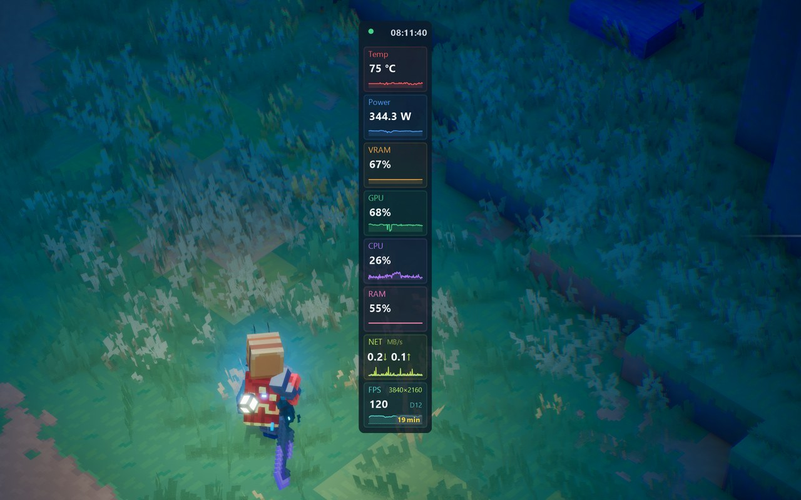

## What's new in 1.0

- **In-game overlay.** The dashboard is drawn inside Direct3D 11 and Direct3D 12 games, so it stays visible in exclusive and borderless fullscreen where a desktop window cannot. Nothing is injected until you press the overlay hotkey with a game in front. Built on [Splice](https://github.com/allenk/splice).
- **Overlay hotkey.** `Alt`+`F10` by default, recorded the way PowerToys records shortcuts, checked against Windows for conflicts.
- **A new way of measuring FPS.** GTG now tells whether a game's frames are composed by Windows or flipped straight to the screen, and counts the right thing for each.
- **Wall clock and play time.** The OSD header shows the time when the pointer is away; the FPS card shows how long you have been playing.
- **Magnetic alignment.** The OSD snaps to screen and taskbar edges while you drag it.
- **Light and dark themes**, following Windows or chosen by hand, and a redesigned main window.

## Downloads

Each release has two packages. The executable in both is the same file; the overlay is the DLL beside it.

| Package | Contents | For |
| --- | --- | --- |
| `GpuThermalGuard-<version>-windows-x64.zip` **(recommended)** | `GpuThermalGuard.exe`, `gtg_overlay.dll` | everyone; the only way the dashboard is visible in fullscreen games |
| `GpuThermalGuard-<version>-no-overlay-windows-x64.zip` | `GpuThermalGuard.exe` | machines that never need the in-game overlay |

Without `gtg_overlay.dll` beside the EXE, the overlay controls are not shown and no hotkey is registered. Add the DLL and restart GTG to enable it.

## Screenshots

| Light | Dark |
| --- | --- |
| 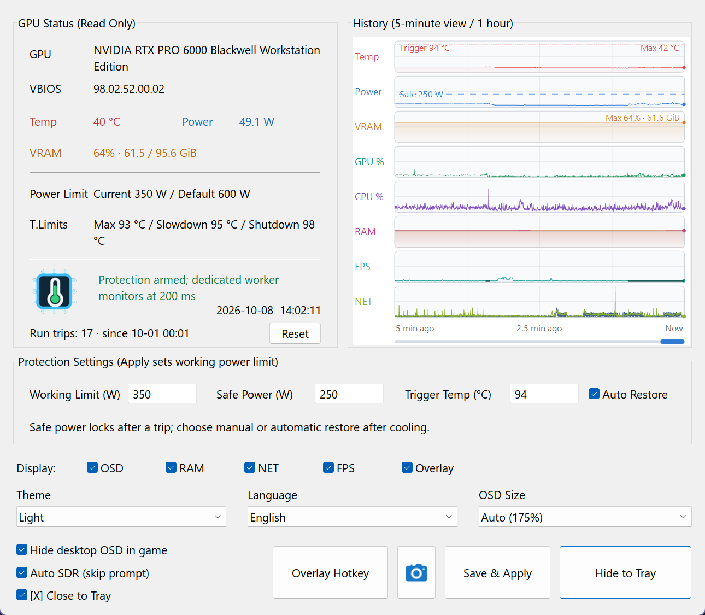 | 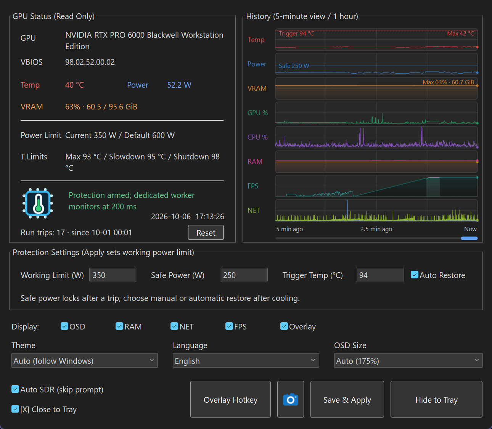 |

Screenshots show one workstation's settings, not recommended limits for every GPU.

## In-game overlay

| Direct3D 12 | Direct3D 11 |
| --- | --- |
| 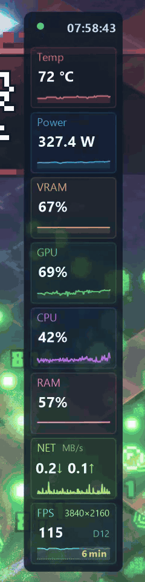 | 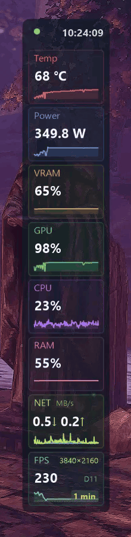 |

A desktop OSD is a window, and a game in exclusive fullscreen -- or one that keeps itself on top -- simply covers it. The overlay draws the same dashboard **inside the game's own frame**: GTG renders it, and a small DLL in the game uploads the picture and draws it just before the game presents. Same records, same arrangement, same size, placed where the desktop OSD sits on its screen.

### How it works

1. **Overlay** in the main window is checked by default. It registers the hotkey; it injects nothing.
2. Bring a game to the front and press the hotkey. GTG starts a short-lived helper (the same EXE), which checks the target -- a native 64-bit process in your session, not a system or critical process, not under the Windows directory, not GTG itself -- works out the Direct3D entry points **in its own process** without touching the game, and only then loads `gtg_overlay.dll` into the game. In our tests the dashboard appears in well under a second.
3. Press the hotkey again in that game to hide the overlay, and again to show it.
4. Up to **four games** can carry the overlay at the same time; each has its own session.

The DLL stays loaded until the game exits -- hiding the overlay or switching the feature off stops drawing, it does not unload code from a running game. The helper process lives as long as the game does and ends with it. Restart a game before replacing GTG's files.

### Overlay hotkey

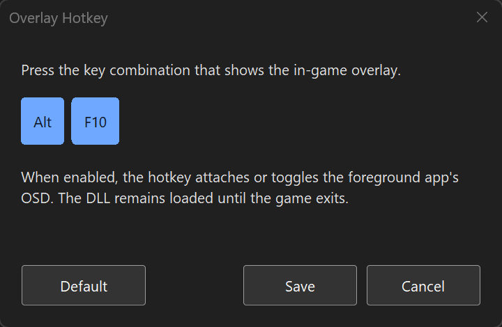

Press the combination you want; it is shown as keycaps and checked as you type. A combination needs `Ctrl`, `Alt`, `Shift` or `Win`; `F12` is refused because Windows reserves it for debuggers; a combination another program already holds is reported instead of saved. While the dialog is open and in front, the keys you press go to it and nowhere else, so `Alt` opens no menu and `Win` no Start.

### Colour

**Auto SDR (skip prompt)** is checked by default: the overlay assumes the game is SDR and draws without asking. Unchecked, the first press in each game asks whether to interpret it as SDR or to stay strict. HDR output is not supported; an overlay on an HDR game may look too bright or washed out.

### What it supports, and what it does not

- **Supported:** native 64-bit Direct3D 11 and Direct3D 12 games, windowed, borderless or fullscreen.
- **Not supported:** Vulkan, OpenGL and Direct3D 9 games (the desktop OSD still works over them where it can be seen), 32-bit games, HDR.
- **Anti-cheat.** GTG does nothing to hide from anti-cheat: no hidden modules, no manual mapping, no unlinking. A game with anti-cheat may refuse the overlay or treat it as a cheat. **Do not use the overlay in protected or competitive online games.** Where a game refuses it, that game is unsupported.

### Built on Splice

The overlay hooks the game's present path with [Splice](https://github.com/allenk/splice), a cross-platform, type-safe C++ hooking library by the same author. Installing a hook into a process whose render thread may be executing the very bytes being replaced is the hardest case there is, and Splice 1.1 was largely shaped by it: atomic five-byte installs through a nearby relay, strict exact-site installation, and coordination of the threads caught inside the patch. Splice is a submodule of this repository, so the code that writes into the game is open for anyone to read.

## The desktop OSD

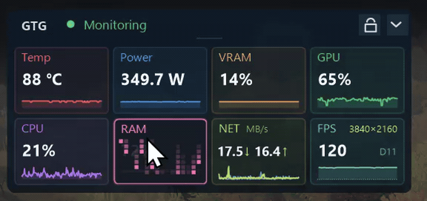

A one-minute walkthrough of an earlier release, recorded over a game at 4K, is on [YouTube](https://www.youtube.com/watch?v=1urYDlP_he0).

### Compact OSD

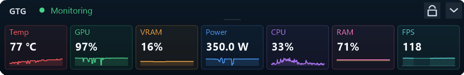

Use the chevron in the OSD header to switch between the full charts and compact mode. Compact mode shows each record as a small card with a live value and a 30-second miniature trend. **RAM**, **NET** and **FPS** each add a card; unchecking one returns the layout to the records that remain. The chevron stays where you clicked it: the window grows and shrinks to its left, so clicking repeatedly expands and collapses in place.

By default every enabled record sits on one row. You can also arrange it into two rows:

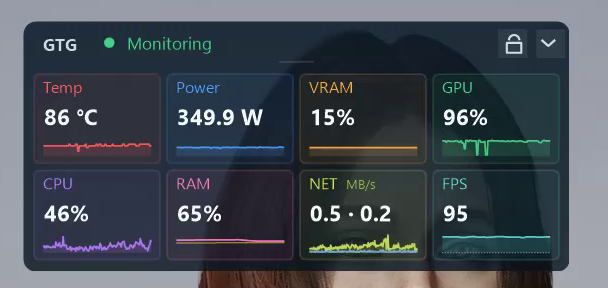

Or into a single column, which suits a screen edge:

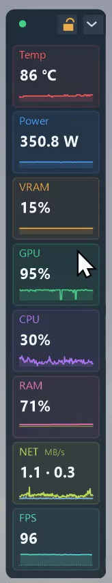

Protection alerts and telemetry warnings remain visible in the header. Switching views does not pause monitoring or change protection settings. Each view reopens where you left it.

### Arranging the compact OSD

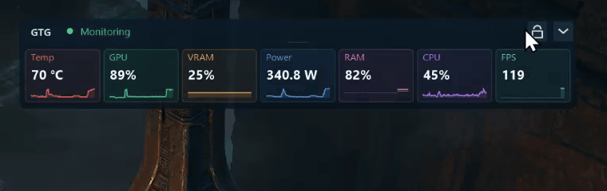

The lock control left of the chevron toggles between locked, where the cards ignore the pointer, and unlocked, where they do not. Locked is the resting state and is drawn quietly; unlocked turns amber, because an always-on-top window that accepts drags should say so.

Unlocked, press a card and release it where you want it:

- release it on the same row to reorder,
- release it below the row to move it into a second row,
- release it on the first row to bring it back up.

Any row can hold a single card, so the whole dashboard can be one column. The expanded OSD follows the same order. The arrangement is remembered between runs, and **Reset OSD layout** in the tray menu restores the default.

### Magnetic alignment

Dragging the OSD by its header pulls it onto the edges of the screen it is on -- the taskbar's edge and the screen's own edge both -- and onto the seam between two monitors. Drag past the edge and it lets go. Hold `Shift` to place it freely.

### Wall clock

Two seconds after the pointer leaves the OSD, the lock and the chevron give their place to the time, `23:59:59`; they come back the moment the pointer returns. While the arrangement is unlocked they stay, because the amber lock is the one thing you must not miss. The in-game overlay cannot be clicked, so it always shows the clock.

### Play time

The FPS card carries how long you have been playing, in yellow in the corner of its curve: `42 min`, then `7.2 hr`, up to `99.9 hr`. It counts only while a game has a steady frame rate, so `Alt`+`Tab`, menus and loading screens pause it rather than reset it. A restarted game carries on. When the game being counted has had no frame rate for three minutes -- you moved to another game, or stopped -- the count goes to whatever is playing now, with the time it earned in those three minutes added back. It is kept in memory and starts again with GTG.

### Optional host RAM

**RAM** is checked by default and adds a host memory record to the dashboard, the expanded OSD and the compact OSD. Physical memory usage is the foreground reading; virtual commit is drawn behind it in a second accent, so you can see both without one competing with the other.

Virtual commit is measured against the system commit limit, which is larger than installed physical memory, so the commit curve normally sits below the physical one. Turning the record off clears its history immediately.

The reading comes from a single `GlobalMemoryStatusEx` call on the existing display tick. It adds no dependency, is never read on the 200 ms protection path, and is not written to the log.

### Releasing host memory

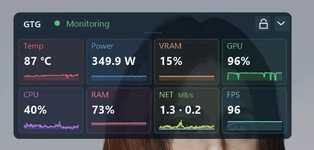

Double-clicking the RAM card on a locked compact dashboard asks Windows to trim working sets and release the standby list, then reports how much host memory came back. The card animates while the work runs on its own thread -- the animation is not a progress bar, because how long a trim takes is set by the processes being trimmed, and it is there to show that the message loop is not blocked.

Nothing pops up and nothing takes focus, so it is safe to use with a game in front. If the machine moved less than the noise floor, the card says so rather than claiming a gain. The action requires the dashboard to be locked: unlocked is arrange mode, and a drag and an action must not compete for the same gesture.

This is a user-initiated action on other processes, so each run is written to the log.

### Optional network throughput

**NET** is checked by default and adds a network record. One card carries both directions as two curves with a translucent fill: receive above, transmit below.

The interface is the one the default route uses, re-checked every three seconds, so a VPN coming up or a cable being unplugged follows the traffic rather than a name chosen at startup. Counters come from `GetIfEntry2` on the existing display tick, and a reading is refused rather than guessed whenever it cannot be trusted: a counter that went backwards, a gap longer than five seconds, an interface that changed underneath, or a rate above what the link can carry.

Both directions are shown in **MB/s** at every magnitude. A unit that changes with the value is unreadable at this size -- the eye reads the number, not the suffix, and 800 KB/s beside 12 MB/s looks larger than it is.

### A verdict on the network path

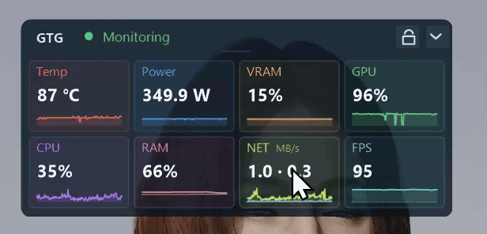

Double-clicking the NET card measures the foreground program's TCP connections and reports a verdict: a latency in milliseconds, a colour, and a three-bar mark.

The recording above is a real run against a game, and it ends in `--` -- connections were watched, but none of them carried enough traffic during the window to measure. That is the honest outcome for a game that plays over UDP, and it is shown here rather than a flattering one, because the gesture is worth knowing about and the result is not guaranteed to be useful.

Every figure comes from counters the Windows TCP stack already keeps for those connections -- round-trip time, its variance, retransmissions, duplicate acknowledgements, timeouts. Nothing is sent, opened or resolved in order to time it, and the connections measured are only those belonging to the program in front of you.

**What it does not claim.** The action also discards the cached path state and re-resolves the next hop. That was measured against a control and found to be below the noise, so it is offered as an attempt and never reported as an improvement. The verdict is the part that is promised: when nothing improves, you still learn something true about your connection.

Two limits worth knowing before you read a verdict:

- **TCP only.** Windows keeps no per-connection statistics for UDP, and many games use UDP for gameplay. Such a game will report `no TCP` rather than a verdict.
- **IPv4 only** in this release.

When there is no verdict the card says which reason: `no TCP` when the program holds no established IPv4 TCP connection, `no app` when there is nothing in the foreground to ask about, `denied` when the statistics were refused, `--` when connections were watched but none carried enough traffic to measure.

The verdict is the worst of the connections measured, never the average -- a game with one healthy connection and one that is timing out is not half fine. That rule is right for a game, which holds a few connections all to its server, and pessimistic for a browser holding a crowd of unrelated ones.

## Frame rate

**FPS** is checked by default and adds an FPS history lane to the dashboard and a card to the OSD. It follows the foreground program and is read from Windows' own event tracing -- nothing is injected to measure it, and it works with or without the overlay. The FPS collector is outside the independent 200 ms protection loop.

**What is counted depends on how the frames reach the screen**, and GTG now tells the two apart:

- **Composed** -- Windows' compositor (DWM) puts the game's frame on screen. GTG counts the frames that actually reached the display, so a game rendering 240 frames a second on a 120 Hz monitor reads 120.
- **Independent flip** -- the frames bypass the compositor and go straight to the screen, which is what most fullscreen and borderless games do when nothing is laid over them. Windows reports no per-frame display confirmation for this path, so GTG counts the frames the game presented, in the graphics kernel.

A game can move between the two while it runs -- an overlay or a notification laid over it makes Windows compose it -- and the reading follows. Earlier versions counted only the composed path and, for a game on independent flip, could show a fraction of its real rate or nothing at all; 1.0 fixes both.

For Vulkan and OpenGL, which produce no composition token, the reading is the presented rate, as it has been since 0.13.

The card names what produced the number when that can be established: `D9`, `D11`, `D12`, `VK` or `GL`, and the resolution the program actually presented. If either cannot be identified it is left out -- nothing is guessed. The resolution is the swapchain the program put up, which for a game upscaling with DLSS or FSR is its full output size.

It shows `-` during warm-up, across focus changes, and whenever the foreground program is presenting nothing -- an idle program has no frame rate. Dark curve sections are visual continuity, **not measured FPS**.

## Themes

The **Theme** list offers **Auto** (follows the Windows app mode, and switches with it while GTG runs), **Dark** and **Light**. Light is the classic Windows look. High-contrast mode always gets the system's own colours, and a Windows build that cannot draw the dark controls falls back to light rather than half-dark. The dark theme is drawn with [darkmodelib](https://github.com/ozone10/darkmodelib), compiled into the EXE.

## Why I built it

This project started with an RTX PRO 6000 Blackwell Workstation Edition used for sustained AI inference. Under long-running workloads, Windows would occasionally report a TDR or lose the GPU. The recurring incident pattern was difficult to ignore:

- the GPU fan suddenly went to 100%;
- telemetry around the incident commonly showed approximately 88–93 °C;
- the driver/GPU did not always recover cleanly after the reset;
- unattended inference jobs were therefore unsafe to leave running.

Reducing the board power limit from 600 W to 350 W made the machine substantially more usable, but a permanent static cap was a blunt workaround. What I wanted was a small guard that could watch temperature continuously, react before the firmware/driver protection path became unreliable, preserve evidence of the incident, and keep the safer limit latched until recovery was explicitly allowed.

The usual gaming-oriented tuning and fan-control applications did not support this workstation board or did not provide the required temperature-to-power-limit safety policy. NVIDIA App exposed useful telemetry, but not the control needed for this workflow. NVML did expose a supported power-limit path, so GpuThermalGuard was built around that narrow, verifiable mechanism.

## The VBIOS and RMA context

This project does not claim that every black screen or TDR has the same cause. However, the RTX PRO 6000 Blackwell investigation uncovered relevant reports around early VBIOS versions:

- In one [RTX PRO 6000 black-screen report](https://forums.developer.nvidia.com/t/nvidia-rtx-6000-pro-blackwell-workstation-screens-keep-going-black/351107), the affected card was replaced and returned with a newer VBIOS; the reporter stated that the problem was resolved.
- NVIDIA forum guidance for the [RTX PRO 6000 VBIOS update path](https://forums.developer.nvidia.com/t/rtx-pro-6k-bwe-vbios-how-to-obtain/366329) explains that channel partners may have SKU-specific VBIOS customization and that the correct field updater or RMA must be obtained through the reseller/distributor chain.
- A later [firmware-channel discussion](https://forums.developer.nvidia.com/t/rtx-pro-6000-blackwell-workstation-edition-vbios-too-old-for-mig-98-02-52-00-02-how-to-obtain-update/374970) reiterates that subsystem IDs alone do not identify the support channel and recommends serial-number verification with the reseller or distributor.

Do not cross-flash a ROM downloaded for a different board or channel SKU. GpuThermalGuard is intended to reduce risk while an official firmware/support resolution is pursued; it is not a substitute for that resolution.

## Design principles

- **Native and small** — C++20, Win32, WTL, GDI/GDI+; no browser runtime and no GPU rendering backend in the main application.
- **Independent protection loop** — a dedicated high-priority worker targets a 200 ms cadence; UI repaint, the OSD, FPS and the overlay do not schedule protection. Driver calls can still stall, so this is not a hard real-time guarantee.
- **Fail-safe state model** — a hard temperature crossing is never hidden by debounce or smoothing.
- **Verified writes** — a power-limit change is not reported as successful until it is read back.
- **Safe latch** — after a trip, safe power remains active until stable cooling permits manual or explicitly enabled automatic restore.
- **Immediately rearmed** — automatic restore never relaxes monitoring; a renewed over-temperature condition can trip again immediately.
- **Incident evidence** — rolling telemetry, logs, trip count and a trip marker on the temperature history, wall time, and automatic/manual PNG snapshots.
- **Opt-in injection** — the desktop OSD and FPS use no injection or hook. Only the overlay writes into a game, only into the game in front, and only when you press the hotkey.
- **Standalone deployment** — static MSVC runtime; no installer, no runtime to install. `GpuThermalGuard.exe` needs only Windows system DLLs and the NVIDIA driver's `nvml.dll`; `gtg_overlay.dll` needs only Windows system DLLs.

## What it monitors

- GPU model, VBIOS version, temperature, and firmware thermal thresholds
- board power draw and current/default power limits
- VRAM usage percentage and GiB
- GPU utilization
- CPU utilization
- optional host RAM usage, with virtual commit shown behind it
- optional network throughput on the default-route interface, both directions in one card
- optional foreground-game FPS: displayed frames when composed, presented frames on independent flip, Vulkan and OpenGL
- play time on the FPS card
- one hour of retained telemetry with a draggable five-minute dashboard view
- a compact, non-activating 30-second always-on-top OSD, and the same dashboard inside Direct3D 11/12 games

## Protection behavior

1. Read NVML telemetry every 200 ms.
2. Trip immediately at the configured temperature, or after the confirmed predictive-rise rule indicates an imminent crossing.
3. Apply the configured safe power limit and read it back.
4. Latch the protected state, persist the trip count, record the event, mark it on the temperature history, and capture a dashboard snapshot.
5. Continue enforcing safe power while cooling.
6. After the stable-cooling window, offer manual restore or perform it only when **Auto Restore** was explicitly enabled.
7. Verify normal power after restore and immediately rearm the protection loop.

The lifetime trip total persists across restarts, manual/automatic restore, and **Save & Apply**. Use **Reset** beside **Run trips** to begin a new test session without interrupting protection or changing the lifetime total.

**Working Limit (W)** is the operating power ceiling. **Save & Apply** requests that limit through the protection worker only when its safety checks permit it; a latched or hot GPU is not forced back to working power. Starting the application does not submit an Apply request. Unapplied edits turn the button orange; inspect the displayed current limit and status for the verified result.

### First run: monitoring only, until you choose otherwise

The initial power settings are read from the card instead of being constants. A 350 W default is unwritable on a 320 W board and is a 42% cut on a 600 W one, so on first run:

- **Working Limit** is the limit already in force. Deriving it from the card's default would *raise* the limit of anyone who had deliberately lowered it, without being asked.
- **Safe Power** is the lower of the card's default limit and its current one.
- **Trigger Temp** is one degree below the GPU's own slowdown threshold, as the driver reports it.

On a card nobody has touched, working and safe come out equal -- and equal limits mean there is nothing to drop to, so GpuThermalGuard **monitors and does not protect**. That is deliberate: the alternative is a tool that silently starts cutting power on a machine whose owner never chose a safe limit. A message on first run says so, and the status line reads *Monitoring at 200 ms; set a Safe Power to enable protection* until you set a safe power below your working limit and apply it.

Both values are clamped into the range the card itself reports, so a limit the hardware would reject cannot be entered.

Restore failures retain the latch and attempt a verified safe-power fallback. Automatic recovery is bounded to three attempts per latch, at least five seconds apart and still subject to fresh cooling checks; permanent errors stop retries early. The log records write/readback evidence. Manual restore remains available.

The OSD displays an **ALERT** while safe power is latched, including while waiting for restore. Delayed presentation samples are visually marked rather than silently presented as fresh measurements. Missing protection telemetry is handled separately by the protection core.

## Language and settings

English is the first-run default. Traditional Chinese can be selected from the **Language** list. The choice is embedded in the EXE and persisted for the current user at:

```text
HKCU\SOFTWARE\GpuThermalGuard\UiLanguage
```

The theme, OSD placement, overlay and hotkey choices are stored beside it under `HKCU\SOFTWARE\GpuThermalGuard`. Protection settings and persistent protection state are stored under:

```text
HKLM\SOFTWARE\GpuThermalGuard
```

The application requests administrator privileges because changing an NVIDIA power limit and writing machine-wide protection settings require elevation. The version is shown in the main window's title bar.

## Running

The default mode is the tray application:

```powershell
.\GpuThermalGuard.exe
.\GpuThermalGuard.exe --tray
```

Default/Tray launch uses an NVML-free supervisor and a monitored child, both from the same EXE. Unexpected child failure triggers bounded-backoff restart and conservative recovery checks; intentional Exit stops the application. This reduces outages but cannot guarantee uninterrupted protection during driver failure. No separate supervisor service or installer is required. While a game carries the overlay, a third process -- the overlay helper -- runs beside them and ends with the game.

The same executable also contains an SCM service entry point:

```text
GpuThermalGuard.exe --service
```

`--service` is intended to be launched by Windows Service Control Manager, not directly from an interactive console. No installer is shipped; tray mode is the recommended way to run it.

## Build from source

Requirements:

- Windows 10/11 x64
- Visual Studio 2022 with Desktop development with C++
- CMake 3.24+
- Ninja (included with Visual Studio CMake tools)
- [vcpkg](https://github.com/microsoft/vcpkg), with `VCPKG_ROOT` set (the overlay's Dear ImGui comes from `vcpkg.json`)
- an NVIDIA driver that provides NVML at runtime

```powershell
git clone --recurse-submodules https://github.com/allenk/GpuThermalGuard.git
```

From a Visual Studio 2022 Developer PowerShell:

```powershell
cmake --preset windows-x64-release
cmake --build --preset windows-x64-release
ctest --preset windows-x64-release --output-on-failure
```

Outputs:

```text
out\build\windows-x64-release\GpuThermalGuard.exe
out\build\windows-x64-release\gtg_overlay.dll
out\build\windows-x64-release\GpuThermalGuardProbe.exe
```

`-DGTG_FEATURE_OVERLAY=OFF` builds without the overlay and needs neither vcpkg nor Splice. `GpuThermalGuardProbe.exe` is a development tool, built from source only and not in the downloads; it is read-only and never calls an NVML setter.

## Logs and snapshots

When the executable directory is not writable, files are stored in standard per-user/per-machine locations:

```text
%LOCALAPPDATA%\GpuThermalGuard\logs
%LOCALAPPDATA%\GpuThermalGuard\snapshots
%PROGRAMDATA%\GpuThermalGuard\logs     (service)
```

Snapshots can be created from the main window or tray menu and are also captured after a thermal trigger. Hidden-window capture renders the dashboard client area without forcing the window to the foreground.

## Beyond the desktop: a private System Monitor experiment

Long-running inference jobs are not always watched from the workstation itself. A separate, private **System Monitor** explores a remote browser dashboard: GPU/CPU activity, physical memory and commit usage, disk capacity, and GTG protection events in one view.

GTG stays local and standalone. The companion collector reads GTG logs as one information source, collects additional host metrics, and sends updates to an access-controlled web application. Remote connectivity is not part of GTG's thermal decision loop. Log timestamps and stale-data indicators distinguish historical evidence from live state.

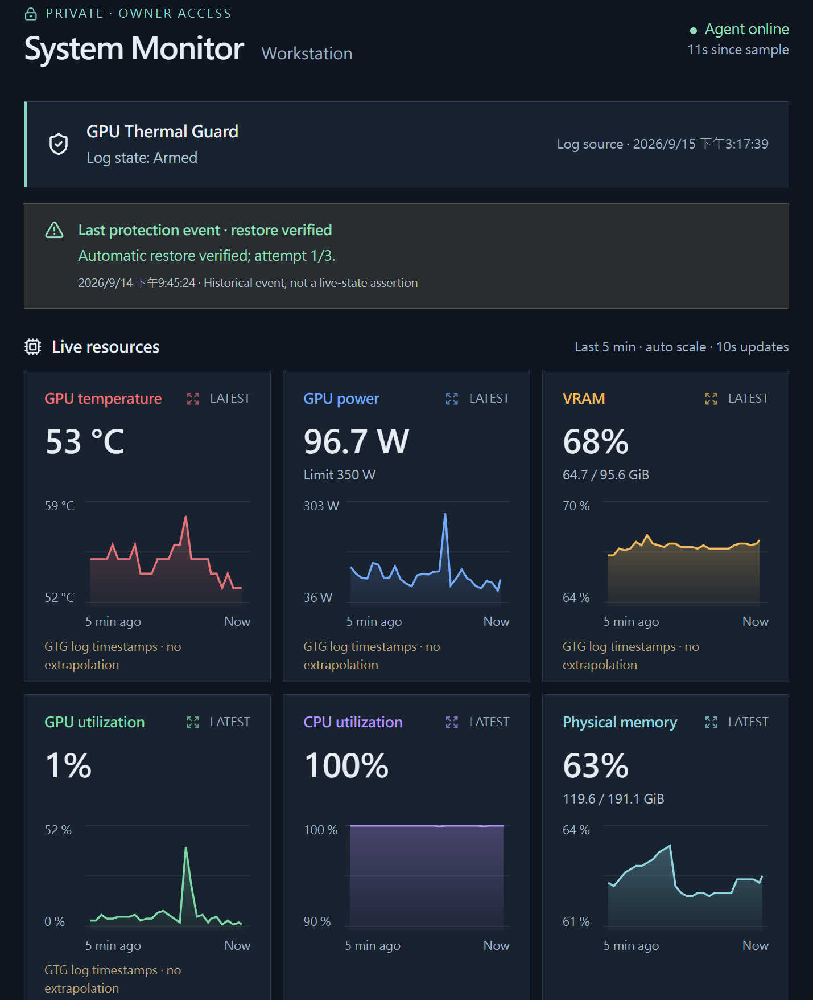

Metric cards open a detail view with selectable time ranges and chart scaling. The VRAM example also shows a private, fixed-action WSL workflow for stopping or launching an inference model; those actions belong to the companion, not to GTG's protection controller. The screenshot includes historical failures as well as a later successful action.

<details>
<summary>View the private VRAM detail and inference-workflow example</summary>

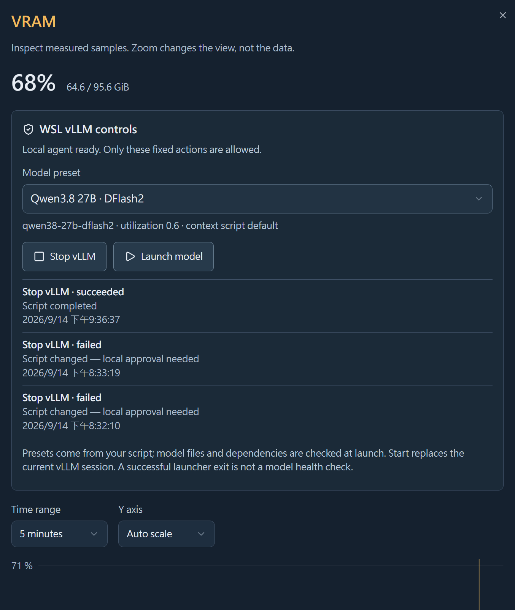

</details>

**Preview only:** System Monitor, its collector, backend, credentials, and remote controls are not open source or included in this repository or GTG releases. These screenshots illustrate a possible integration, not an available GTG feature or a hosted service offered to users. GTG requires no cloud account or network connection for local protection.

## Current limitations

- Windows and NVIDIA NVML only.
- The current release protects one selected/default GPU; multi-GPU policy is not complete.
- No installer or service-management UI yet.
- No guarantee against every TDR, driver reset, sudden sensor failure, or hardware fault.
- The in-game overlay supports native 64-bit Direct3D 11 and 12 games only; not Vulkan, OpenGL, Direct3D 9, 32-bit games or HDR. Games with anti-cheat may refuse it.
- Hardware-specific safe power and temperature values must be chosen responsibly.

## Release integrity

Published releases are tag-driven. The release workflow validates version consistency, builds and tests on GitHub Actions, produces `SHA256SUMS.txt`, and publishes a build-provenance attestation for both packages. When an Authenticode certificate is configured, the executables and the overlay DLL are signed and verified before packaging. **1.0.0 is not Authenticode-signed**; the release notes say so, and the archives are verified by checksum and attestation instead. Release notes are taken from [CHANGELOG.md](CHANGELOG.md).

After downloading a release archive, verify that its exact bytes were produced by this repository's GitHub Actions workflow:

```powershell
gh attestation verify .\GpuThermalGuard-<version>-windows-x64.zip -R allenk/GpuThermalGuard
```

This provenance check does not replace Authenticode publisher identity or malware scanning. Windows SmartScreen may warn about unsigned executables, and some antivirus products flag any program that loads a DLL into another process; the overlay does exactly that, by design and only on your hotkey.

## Contributing and security

See [CONTRIBUTING.md](CONTRIBUTING.md) for development guidelines. Please report security-sensitive issues privately as described in [SECURITY.md](SECURITY.md).

## Author

**AllenK (kwyshell)** — [GitHub](https://github.com/allenk) · [Medium](https://medium.com/@allenkuo)

## License

GpuThermalGuard is released under the [MIT License](LICENSE). Third-party components keep their own terms: WTL (Microsoft Public License), the NVIDIA NVML header (NVIDIA's notice), darkmodelib (Mozilla Public License 2.0, with some code under MIT), Dear ImGui (MIT) and Splice (MIT). See [THIRD_PARTY_NOTICES.md](THIRD_PARTY_NOTICES.md).
