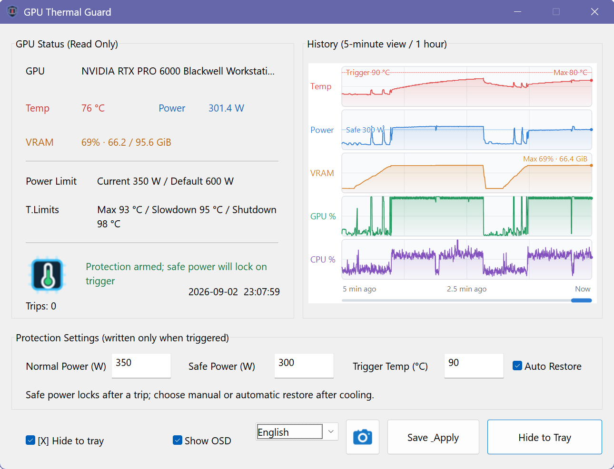
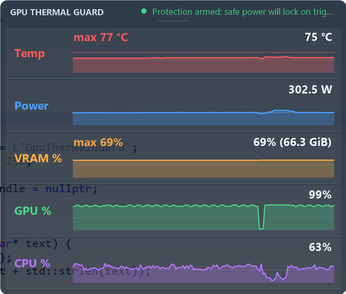
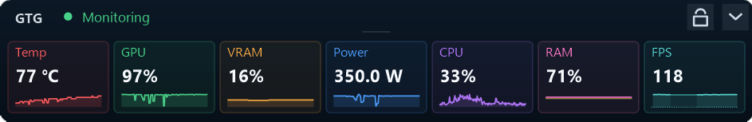
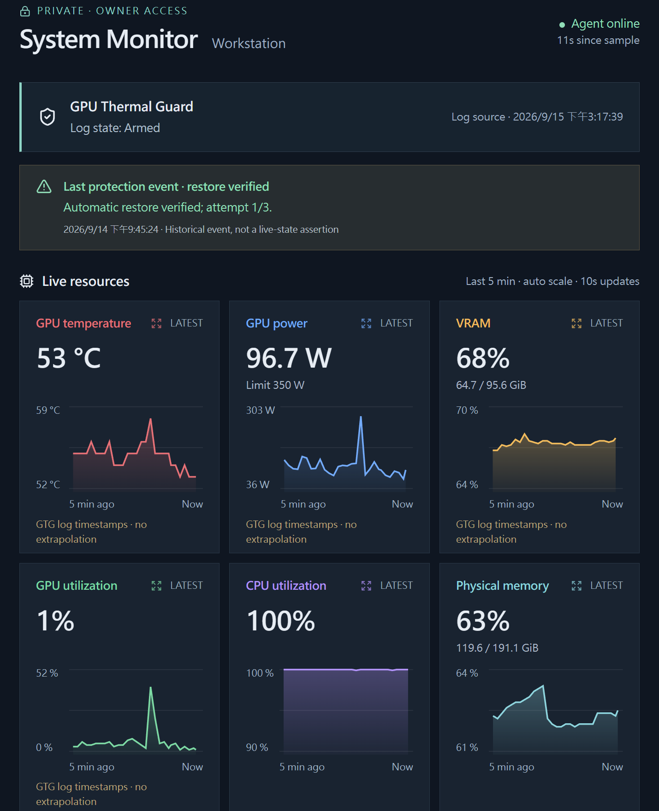
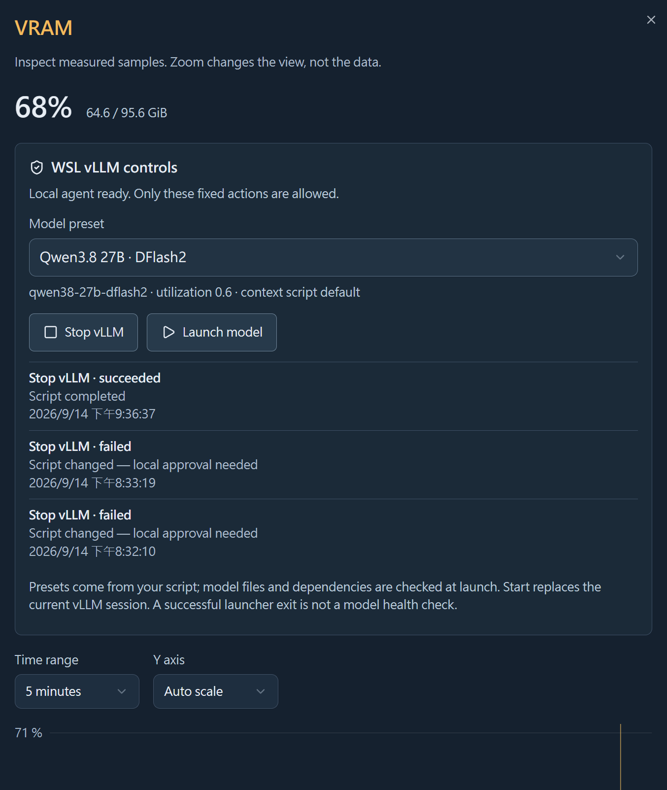

# GpuThermalGuard

[English](README.md) | 繁體中文

**以 NVML 為核心、輕量的 Windows NVIDIA GPU 溫度保護與即時監控工具。**

GpuThermalGuard 持續監控 GPU telemetry；偵測到危險溫度或快速上升的熱趨勢時，會套用預先設定的較低功率限制。它以原生 C++/Win32 製作，目標是在 GPU 本身可能不穩定時，依然提供小型、快速而可靠的保護層。

> [!WARNING]
> 這是獨立開發的風險緩解工具，不是 NVIDIA 產品，也不是韌體、驅動、散熱或硬體修復方案。它無法保證攔截所有 TDR；受影響或故障的顯示卡仍可能需要官方、SKU 相符的 VBIOS 更新或 RMA。

## 畫面

| 主監控面板 | 30 秒即時 OSD |
| --- | --- |
|  |  |

截圖中的設定屬於單一工作站，不是所有 GPU 的建議門檻。

### Compact 精簡 OSD



點擊 OSD 頂部的箭頭，可在完整圖表與 compact mode 之間切換。精簡模式維持相同寬度及按鈕位置，以五張小卡顯示溫度、功率、VRAM、GPU 與 CPU 使用率，搭配即時數值及最近 30 秒的迷你曲線，減少桌面遮擋。

保護警報與遙測警示仍顯示於頂部；切換模式不會暫停監控或改變保護設定。頂部按鈕以外的拖曳區仍可移動 OSD；重新啟動程式後回到展開模式。

此功能自 v0.9.1-beta.1 起提供。

## 為什麼打造這個工具

這個專案源自一張長時間執行 AI 推理的 RTX PRO 6000 Blackwell Workstation Edition。持續負載下，Windows 偶爾會發生 TDR 或失去 GPU；反覆出現的事故特徵包括：

- GPU 風扇突然全速運轉；
- 事故前後 telemetry 經常落在約 88–93 °C；
- driver/GPU reset 後不一定能正常恢復；
- 無人看管的長時間 AI 推理因此存在風險。

把 600 W 功率限制固定降到 350 W 後，系統明顯更能穩定工作，但永久限制功率是很粗略的 workaround。真正需要的是一個小型 guard：持續看守溫度、在韌體或驅動保護路徑失效前介入、保存事故樣貌，並在明確允許恢復之前保持安全功率鎖定。

常見的遊戲調校與風扇控制工具不是不支援這張工作站顯示卡，就是無法實作所需的「溫度觸發 → 降功率 → 冷卻 → 人工或明確啟用的自動恢復」策略。NVIDIA App 能顯示資料，但不提供這個控制流程；NVML 則具備正式的 power-limit 路徑，因此 GpuThermalGuard 專注在這個狹窄且可讀回驗證的機制。

## VBIOS 與 RMA 背景

本專案不宣稱所有黑畫面或 TDR 都有相同原因。不過，RTX PRO 6000 Blackwell 的查證確實發現一些與早期 VBIOS 有關的案例：

- 一則 [RTX PRO 6000 黑畫面回報](https://forums.developer.nvidia.com/t/nvidia-rtx-6000-pro-blackwell-workstation-screens-keep-going-black/351107) 中，受影響顯示卡經更換並取得較新 VBIOS 後，回報者表示問題已解決。
- NVIDIA 論壇對 [RTX PRO 6000 VBIOS 取得方式](https://forums.developer.nvidia.com/t/rtx-pro-6k-bwe-vbios-how-to-obtain/366329) 的說明指出，不同通路可能有各自的 SKU 與 VBIOS 客製版本，正確的 field updater 或 RMA 必須經 reseller/distributor 鏈取得。
- 後續的 [韌體通路討論](https://forums.developer.nvidia.com/t/rtx-pro-6000-blackwell-workstation-edition-vbios-too-old-for-mig-98-02-52-00-02-how-to-obtain-update/374970) 再次提醒：Subsystem ID 本身不足以判斷支援通路，應由 reseller 或 distributor 依序號確認。

不要把其他板卡或通路 SKU 的 ROM 拿來交叉強刷。GpuThermalGuard 的定位是在等待官方韌體或售後處理期間降低風險，不是取代官方修復。

## 設計理念

- **原生、小型**：C++20、Win32、WTL、GDI/GDI+；沒有瀏覽器 runtime 或 GPU UI backend。
- **獨立保護迴圈**：專用高優先權 worker 以 200 ms 為目標節拍；保護排程不依賴 UI repaint 或訊息迴圈。驅動呼叫仍可能阻塞，因此不是硬即時保證。
- **Fail-safe 狀態機**：硬溫度門檻不會被 debounce 或平滑化掩蓋。
- **寫入必須驗證**：功率限制寫入後必須讀回，否則不宣稱保護成功。
- **安全鎖定**：觸發後維持安全功率；穩定冷卻後才允許人工或明確啟用的自動恢復。
- **立即重新武裝**：自動恢復不會停止或放寬監控；重新過熱可立即再次觸發。
- **保存事故證據**：歷史 telemetry、log、觸發次數、wall-time 與自動／手動 PNG snapshot。
- **Standalone 部署**：MSVC runtime 靜態連結，單一 EXE，不需要旁置 runtime；仍需要 Windows 系統 DLL 與 NVIDIA driver 的 `nvml.dll`。
- **CPU 繪製 UI**：程式不使用 GPU rendering backend；Windows 桌面合成仍可能受到繁忙或恢復中的顯示驅動影響。

## 監控內容

- GPU 型號、VBIOS 版本、溫度與韌體溫度門檻
- 板卡功率與目前／預設功率限制
- VRAM 百分比與 GiB
- GPU Loading
- CPU Loading
- 保留一小時 telemetry、可拖曳的固定五分鐘主面板視野
- 精簡、不搶 focus 的 30 秒 always-on-top OSD

## 保護流程

1. 每 200 ms 讀取 NVML telemetry。
2. 達到設定溫度立即觸發；或由經確認的升溫預測規則判斷即將跨越門檻。
3. 寫入安全功率並讀回驗證。
4. 鎖定保護狀態、保存觸發次數、寫入事件紀錄並擷取主面板快照。
5. 冷卻期間持續維持安全功率。
6. 穩定冷卻完成後，只允許人工恢復，或在使用者明確勾選 **Auto Restore** 時自動恢復。
7. 恢復正常功率後讀回驗證，並立即重新武裝保護迴圈。

累計觸發總數會跨越重啟、人工／自動恢復與 **保存並套用** 持續保留。使用 **本輪觸發** 旁的 **重設** 開始新一輪測試，不會中斷保護或清除累計總數。

**工作功率上限 (W)** 是運作時的功耗牆。**保存並套用** 會透過保護 worker，在安全條件允許時要求套用；不會強行把已鎖定或高溫中的 GPU 恢復到工作功率。啟動程式本身不會提交 Apply。未套用的編輯會有醒目提示；請以目前功率限制與狀態欄確認驗證結果。

恢復失敗會保留鎖定，並嘗試寫回安全功率與讀回驗證。每次鎖定的自動恢復最多嘗試三次、間隔至少五秒，每次仍須通過新鮮的冷卻檢查；永久性錯誤會提早停止重試。Log 保留寫入與讀回證據，人工恢復仍可使用。

OSD 在安全功率鎖定期間顯示 **ALERT**，包含等待恢復的階段。延遲的顯示採樣會標記出來，不會默默冒充即時資料；保護核心的遙測中斷另由保護機制處理。

## 語言與設定

首次執行預設 English；可從視窗底部切換正體中文。兩種語言都內嵌在 EXE，選擇保存在目前使用者：

```text
HKCU\SOFTWARE\GpuThermalGuard\UiLanguage
```

保護參數與持久化狀態位於：

```text
HKLM\SOFTWARE\GpuThermalGuard
```

程式需要系統管理員權限，因為修改 NVIDIA power limit 與寫入機器層級保護設定都需要 elevation。

## 執行模式

預設為系統匣模式：

```powershell
.\GpuThermalGuard.exe
.\GpuThermalGuard.exe --tray
```

預設／Tray 啟動會由不載入 NVML 的 supervisor 管理監控子程序，兩者使用同一支 EXE。子程序異常失敗後會採退避重試與保守的恢復檢查；使用者明確 Exit 則結束程式。這可縮短中斷，但無法保證驅動故障期間完全沒有保護空窗；不需要另外安裝 supervisor service。

同一支 EXE 也包含 SCM service entry point：

```text
GpuThermalGuard.exe --service
```

`--service` 必須由 Windows Service Control Manager 啟動，不能當成一般互動命令使用。目前 preview 尚未提供 installer，建議先以 Tray 模式進行受監看的驗證。

## 從原始碼建置

需求：Windows 10/11 x64、Visual Studio 2022 Desktop C++、CMake 3.24+、Ninja，以及執行時提供 NVML 的 NVIDIA driver。

在 Visual Studio 2022 Developer PowerShell 中：

```powershell
cmake --preset windows-x64-release
cmake --build --preset windows-x64-release
ctest --preset windows-x64-release --output-on-failure
```

輸出：

```text
out\build\windows-x64-release\GpuThermalGuard.exe
out\build\windows-x64-release\GpuThermalGuardProbe.exe
```

Probe 完全唯讀，不會呼叫任何 NVML setter。

## Log 與 Snapshot

當 EXE 目錄不可寫時，會使用：

```text
%LOCALAPPDATA%\GpuThermalGuard\logs
%LOCALAPPDATA%\GpuThermalGuard\snapshots
%PROGRAMDATA%\GpuThermalGuard\logs     (Service)
```

Snapshot 可由主視窗與 Tray 選單建立，也會在溫度保護觸發後自動保存。即使視窗隱藏，仍會在不搶 focus 的情況下繪製並保存主面板 client area。

## 桌面以外：私人 System Monitor 延伸實驗

長時間 AI 推理不一定有人守在工作站旁。另一個獨立、私人的 **System Monitor** 正在探索遠端瀏覽器儀表板：集中顯示 GPU／CPU 活動、實體記憶體與 commit 使用量、磁碟容量，以及 GTG 保護事件。

GTG 維持本機、standalone 設計。獨立 collector 把 GTG log 當作其中一個資訊來源，另外收集主機資源，再上傳到有存取控制的 Web 應用。網路連線不參與 GTG 的溫控決策；log 時間戳與過期標示用來區分歷史證據與即時狀態。



點選指標可查看 detail，調整時間範圍與圖表尺度。VRAM 範例也展示私人、固定動作的 WSL 推理工作流程，可停止或啟動模型；這些動作屬於獨立 companion，不是 GTG 保護控制器。截圖保留先前失敗與後續成功的歷史紀錄。

<details>
<summary>展開私人 VRAM detail 與推理工作流程範例</summary>



</details>

**僅供預覽：** System Monitor、collector、後端、權證與遠端控制尚未開源，也不包含在此 repository 或 GTG release。截圖展示的是可能的整合應用，不是已提供的 GTG 功能或對外開放的託管服務。GTG 本機保護不需要雲端帳號或網路連線。

## 目前限制

- 目前只支援 Windows 與 NVIDIA NVML。
- 現行版本保護單一選定／預設 GPU；多 GPU policy 尚未完成。
- 尚未提供 installer 或 service 管理 UI。
- 無法保證攔截所有 TDR、driver reset、感測器突然失效或硬體故障。
- OSD 不注入、不使用 graphics hook，因此不保證覆蓋 exclusive fullscreen。
- 安全功率與觸發溫度必須依實際硬體審慎設定。

## 發佈完整性

Release 由 tag 驅動。Workflow 會驗證版本一致性、在 GitHub Actions 建置與測試、產生 `SHA256SUMS.txt` 與 build-provenance attestation。有設定 Authenticode 憑證時，EXE 會先簽章並驗證再封裝；尚無憑證時，只會發布清楚標示的 **unsigned prerelease**，壓縮檔名稱包含 `unsigned`，Release Notes 也會顯示警告。Release Notes 取自 [CHANGELOG.md](CHANGELOG.md)。

下載 Release 壓縮檔後，可驗證該檔案是否確實由本 Repository 的 GitHub Actions workflow 產生：

```powershell
gh attestation verify .\GpuThermalGuard-<version>-unsigned-windows-x64.zip -R allenk/GpuThermalGuard
```

Provenance 驗證不能取代 Authenticode 發行者身分或惡意程式掃描；Windows SmartScreen 仍可能警告尚未簽章的 prerelease EXE。

## 作者

**AllenK (kwyshell)** — [GitHub](https://github.com/allenk) · [Medium](https://medium.com/@allenkuo)

## 授權

GpuThermalGuard 採用 [MIT License](LICENSE)。內附 WTL headers 採用 Microsoft Public License；NVIDIA NVML header 保留 NVIDIA 原始授權聲明。詳見 [THIRD_PARTY_NOTICES.md](THIRD_PARTY_NOTICES.md)。
