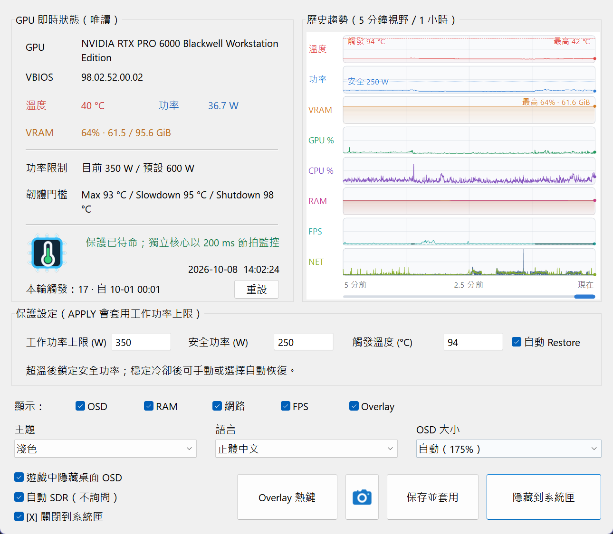
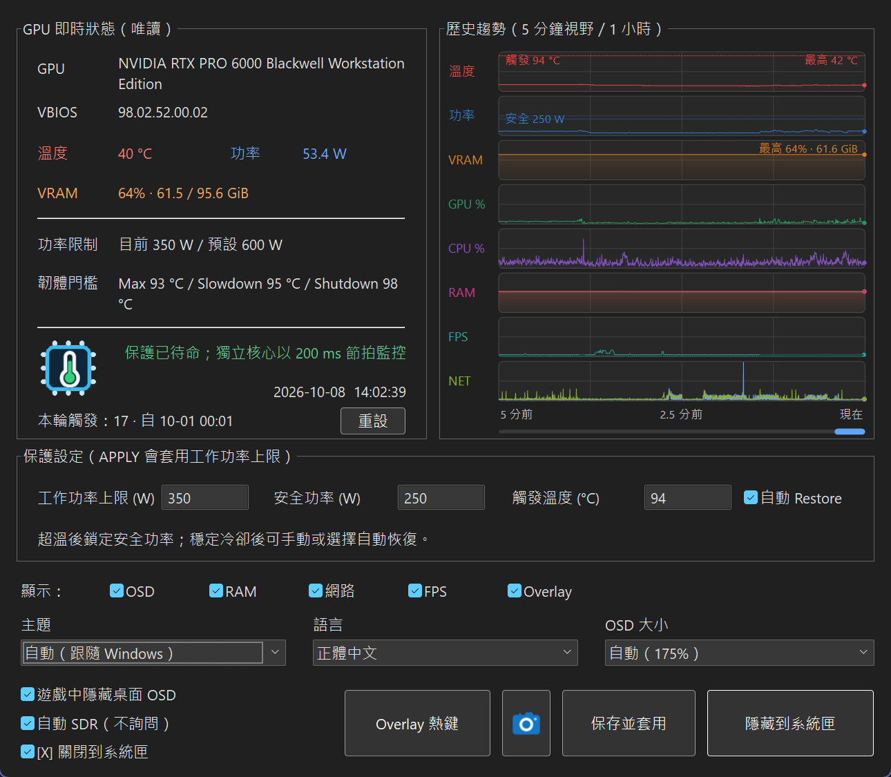
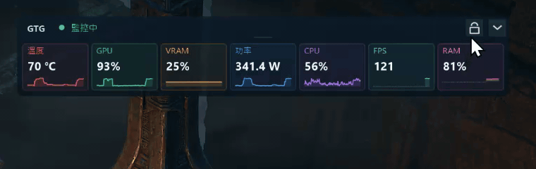

# GpuThermalGuard

[English](README.md) | 繁體中文

**以 NVML 為核心、輕量的 Windows NVIDIA GPU 溫度保護與即時監控工具 —— 現在也能直接畫進遊戲裡。**

GpuThermalGuard 持續監控 GPU telemetry；偵測到危險溫度或快速上升的熱趨勢時，會套用預先設定的較低功率限制。它以原生 C++/Win32 製作，目標是在 GPU 本身可能不穩定時，依然提供小型、快速而可靠的保護層。

> [!WARNING]
> 這是獨立開發的風險緩解工具，不是 NVIDIA 產品，也不是韌體、驅動、散熱或硬體修復方案。它無法保證攔截所有 TDR；受影響或故障的顯示卡仍可能需要官方、SKU 相符的 VBIOS 更新或 RMA。


## 1.0 新功能

- **遊戲內 Overlay。** 面板直接畫在 Direct3D 11 與 Direct3D 12 遊戲的畫面裡，在獨佔全螢幕與無邊框全螢幕下也看得到，桌面視窗做不到這一點。在你按下 Overlay 熱鍵之前，不會注入任何東西。以 [Splice](https://github.com/allenk/splice) 打造。
- **Overlay 熱鍵。** 預設 `Alt`+`F10`，錄製方式參考 PowerToys，並向 Windows 檢查是否與其他程式衝突。
- **全新的 FPS 統計方式。** GTG 現在分得出遊戲畫面是經 Windows 合成，還是直接翻到螢幕上，並對兩種情況計算各自正確的數字。
- **時鐘與遊戲時間。** 滑鼠離開 OSD 時，頂部顯示目前時間；FPS 卡顯示你已經玩了多久。
- **磁吸對齊。** 拖曳 OSD 時會吸附到螢幕與工作列的邊緣。
- **淺色與深色主題**，可跟隨 Windows 或手動選擇；主視窗重新設計。

## 下載

每個版本提供兩個套件。兩者裡的 EXE 是同一個檔案；overlay 就是放在它旁邊的那個 DLL。

| 套件 | 內容 | 適合 |
| --- | --- | --- |
| `GpuThermalGuard-<version>-windows-x64.zip` **（推薦）** | `GpuThermalGuard.exe`、`gtg_overlay.dll` | 所有人；全螢幕遊戲中看得到面板的唯一方式 |
| `GpuThermalGuard-<version>-no-overlay-windows-x64.zip` | `GpuThermalGuard.exe` | 確定用不到遊戲內 overlay 的機器 |

EXE 旁邊沒有 `gtg_overlay.dll` 時，Overlay 相關設定不會顯示，也不會註冊熱鍵。之後放入 DLL 並重新啟動 GTG 即可啟用。

## 畫面

| 淺色 | 深色 |
| --- | --- |
|  |  |

截圖中的設定屬於單一工作站，不是所有 GPU 的建議門檻。

## 遊戲內 Overlay

| Direct3D 12 | Direct3D 11 |
| --- | --- |
|  |  |

桌面 OSD 是一個視窗，獨佔全螢幕的遊戲，或會一直把自己留在最上層的遊戲，就會直接把它蓋住。Overlay 則把同一個面板**畫進遊戲自己的影格裡**：由 GTG 繪製，遊戲行程裡的小 DLL 只負責在遊戲送出畫面前，上傳這張圖並畫上去。項目相同、排列相同、大小相同，位置對應桌面 OSD 在它所在螢幕上的位置。

### 運作方式

1. 主視窗的 **Overlay** 預設勾選。它只註冊熱鍵，不注入任何東西。
2. 讓遊戲在前景，按下熱鍵。GTG 會啟動一個短命的 helper（同一支 EXE），先檢查目標：必須是你這個 session 裡原生的 64 位元行程，不是系統或關鍵行程、不在 Windows 目錄底下、也不是 GTG 自己；接著**在自己的行程裡**算出 Direct3D 的進入點，完全不碰遊戲；全部通過後，才把 `gtg_overlay.dll` 載入遊戲。我們實測時，面板在一秒內就出現。
3. 在同一個遊戲裡再按一次熱鍵隱藏 overlay，再按一次顯示。
4. 最多可以**同時有四個遊戲**掛著 overlay，各自是獨立的 session。

DLL 會留在遊戲裡直到遊戲結束 —— 隱藏 overlay 或關閉這個功能只會停止繪製，不會從執行中的遊戲卸載程式碼。helper 行程跟著遊戲存在，遊戲結束它就結束。要替換 GTG 的檔案前，請先把遊戲關掉重開。

### Overlay 熱鍵


直接按下你要的組合鍵，它會以鍵帽顯示並即時檢查。組合必須含 `Ctrl`、`Alt`、`Shift` 或 `Win`；`F12` 會被拒絕，因為 Windows 保留它給偵錯工具；已被其他程式占用的組合會提示，而不會被存下來。對話框開著且在前景時，你按的鍵只會送到它，所以 `Alt` 不會打開選單、`Win` 也不會打開開始功能表。

### 色彩

**Auto SDR（skip prompt）** 預設勾選：overlay 直接假設遊戲是 SDR，不另外詢問。取消勾選後，每個遊戲第一次按熱鍵時會詢問要以 SDR 解讀，還是維持嚴格模式。不支援 HDR 輸出；在 HDR 遊戲上，overlay 可能偏亮或偏淡。

### 支援與不支援

- **支援：** 原生 64 位元的 Direct3D 11 與 Direct3D 12 遊戲，視窗、無邊框或全螢幕皆可。
- **不支援：** Vulkan、OpenGL 與 Direct3D 9 遊戲（看得到的情況下，桌面 OSD 照樣能用）、32 位元遊戲、HDR。
- **Anti-cheat。** GTG 不做任何躲避 anti-cheat 的事：不隱藏模組、不 manual map、不從 loader 清單移除自己。有 anti-cheat 的遊戲可能拒絕 overlay，或把它當成作弊程式。**請不要在受保護或競技類的線上遊戲中使用 overlay。** 遊戲拒絕它，就代表那款遊戲不支援。

### 以 Splice 打造

Overlay 透過 [Splice](https://github.com/allenk/splice) hook 遊戲送出畫面的路徑。Splice 是同一位作者開發的跨平台、型別安全的 C++ hook 函式庫。把 hook 安裝進一個 render thread 可能正在執行那段被替換程式碼的行程，是最困難的情況，而 Splice 1.1 大部分就是為此而做：透過鄰近 relay 達成原子性的五位元組安裝、嚴格的精確位置安裝，以及協調那些卡在被修補程式碼裡的執行緒。Splice 是本 repository 的 submodule，寫進遊戲的程式碼任何人都能檢視。

## 桌面 OSD


舊版的一分鐘操作影片（在 4K 遊戲畫面上錄製）放在 [YouTube](https://www.youtube.com/watch?v=1urYDlP_he0)。

### Compact 精簡 OSD


點擊 OSD 頂部的箭頭，可在完整圖表與精簡模式之間切換。精簡模式將每個項目顯示為一張小卡，含即時數值與最近 30 秒的迷你曲線。勾選 **RAM**、**網路**、**FPS** 各會增加一張卡；取消勾選後回到其餘項目的配置。箭頭會留在你點擊的位置：視窗往左延伸或縮回，所以連續點擊會在原地展開、收合。

預設會把所有啟用的項目排成一排。你也可以把它排成兩排：


也可以排成單欄，適合貼著螢幕邊緣：


（上面兩張排列示意圖擷取自英文介面。）

保護警報與遙測警示仍顯示於頂部；切換模式不會暫停監控或改變保護設定。兩種模式各自記得上次的位置。

### 調整精簡 OSD 的排列



箭頭左邊的鎖圖示可切換鎖定與解鎖：鎖定時小卡不接收滑鼠，解鎖時才能拖動。鎖定是常態，因此畫得很低調；解鎖會轉為琥珀色，因為一個永遠置頂又接受拖曳的視窗，應該讓使用者知道。

解鎖後，按住一張小卡，放開在你要的位置即可：

- 放在同一排 —— 調整順序
- 放在該排下方 —— 移到第二排
- 放回第一排 —— 移回上排

每一排都可以只有一張，所以整個面板可以排成單欄。展開 OSD 也依照同一個順序。排列會被記住；系統匣選單的「重設 OSD 版面」可回到預設。

### 磁吸對齊

用頂部拖曳 OSD 時，它會被吸到所在螢幕的邊緣 —— 工作列的邊和螢幕本身的邊都會 —— 以及兩個螢幕的交界。拖過邊緣就會放開。按住 `Shift` 可以自由擺放。

### 時鐘

滑鼠離開 OSD 兩秒後，鎖頭和箭頭會讓出位置，改顯示目前時間 `23:59:59`；滑鼠一回來，按鈕立刻出現。排列處於解鎖狀態時按鈕會保留，因為琥珀色的鎖是你一定不能錯過的提醒。遊戲內 overlay 無法點擊，所以一律顯示時鐘。

### 遊戲時間

FPS 卡會顯示你玩了多久，以黃色標在曲線右下角：`42 min`，接著是 `7.2 hr`，最多 `99.9 hr`。只有在遊戲有穩定的影格率時才計時，所以 `Alt`+`Tab`、選單與載入畫面只會暫停，不會歸零。遊戲關掉重開會接著算。正在計時的遊戲超過三分鐘沒有影格率 —— 你換玩別的遊戲，或乾脆不玩了 —— 計時就交給當下正在玩的那個，並把它在這三分鐘裡累積的時間加回去。數值只存在記憶體，GTG 重新啟動就從頭算。

### 可選的主機 RAM

**RAM** 預設勾選，主視窗、展開 OSD 與精簡 OSD 都會加上主機記憶體項目。實體記憶體使用率為前景主角；虛擬 commit 以另一個輔色繪在其後方，兩者同時可讀而不互相搶眼。

虛擬 commit 是以系統 commit limit 為分母，而該上限大於實體記憶體，因此 commit 曲線通常低於實體曲線。關閉後立即清除其紀錄。

讀值來自現有顯示更新節拍上的單次 `GlobalMemoryStatusEx` 呼叫，不增加任何相依，不在 200 ms 保護路徑上讀取，也不寫入 log。

### 釋放主機記憶體


在鎖定的精簡面板上雙擊 RAM 小卡，會請 Windows 收縮各行程的 working set 並釋放 standby list，然後回報拿回多少主機記憶體。工作在自己的執行緒上進行，小卡同時播放動畫 —— 那不是進度條，因為一次收縮要多久是由被收縮的行程決定的；它的作用是讓你看到訊息迴圈沒有被卡住。

過程中不會彈出任何視窗、不會搶走焦點，所以在遊戲前景時使用是安全的。若機器的變化小於雜訊，小卡會照實說，而不是宣稱有收穫。此動作要求面板處於鎖定狀態：解鎖是排列模式，拖曳與動作不能搶同一個手勢。

這是使用者主動對其他行程發動的動作，因此每次執行都會寫入 log。

### 可選的網路流量

**網路** 預設勾選，面板增加網路項目。單一小卡以兩條曲線同時呈現雙向流量，下方填入半透明漸層：上為接收，下為傳送。

取用的介面是「預設路由實際使用的那一張」，每三秒重新確認一次，所以 VPN 連上或網線被拔掉時，它跟著流量走，而不是跟著開機時選定的名字走。計數來自現有顯示節拍上的 `GetIfEntry2`；只要讀值不可信就拒絕輸出而不是猜測 —— 計數倒退、間隔超過五秒、介面在中途換掉、或速率高於該連線的實體上限。

雙向一律以 **MB/s** 呈現。在這麼小的面積上，會變動的單位是讀不出來的 —— 眼睛讀的是數字而不是後綴，800 KB/s 擺在 12 MB/s 旁邊看起來反而比較大。

### 網路路徑的評價


雙擊 NET 小卡，會量測前景程式的 TCP 連線並給出評價：以毫秒表示的延遲、一個顏色，以及三格訊號圖示。

上面這段是對著遊戲的真實執行，結果是 `--` —— 連線有被觀察，但在時間窗內沒有一條承載足夠的流量可供量測。對一個以 UDP 遊玩的遊戲來說，這就是誠實的結果；這裡放的是它而不是一段好看的，因為這個手勢值得讓人知道，而結果並不保證有用。

所有數字都來自 Windows TCP stack 原本就在為那些連線累計的計數 —— 來回時間、其變異、重傳、重複 ACK、逾時。為了計時而發送、開啟或解析任何東西的事一件都沒有做；量到的也只有前景那個程式自己的連線。

**它不宣稱的事。** 這個動作同時會丟棄快取的路徑狀態並重新解析下一跳。那一項經過對照組實測，結果落在雜訊以下，所以它被定位成「嘗試」，絕不會被回報成「改善」。被承諾的是評價這一半：就算什麼都沒有變好，你仍然對自己的連線多知道一件真的事。

讀評價之前有兩個限制值得先知道：

- **只有 TCP。** Windows 不提供 UDP 的逐連線統計，而許多遊戲的遊玩流量走 UDP。那樣的遊戲會顯示 `no TCP` 而不是一個評價。
- 本版本**只看 IPv4**。

沒有評價時，小卡會說是哪一種原因：`no TCP` 表示該程式沒有已建立的 IPv4 TCP 連線，`no app` 表示前景沒有可詢問的程式，`denied` 表示統計被拒絕，`--` 表示連線有被觀察，但沒有一條在時間窗內承載足夠的流量可供量測。

評價取的是所有量到的連線中**最差**的那條，而不是平均 —— 一個遊戲有一條連線健康、另一條在逾時，並不等於「還好一半」。這條規則對遊戲是對的（少數幾條、全都連到遊戲伺服器），對持有大量不相干連線的瀏覽器則過於悲觀。

## 影格率

**FPS** 預設勾選，主視窗增加一條 FPS 歷史，OSD 增加一張 FPS 卡。它跟隨目前前景程式，讀值來自 Windows 自己的事件追蹤（ETW）—— 量測不注入任何東西，有沒有 overlay 都能用。FPS 收集器不參與獨立的 200 ms 保護迴圈。

**計算什麼，取決於畫面怎麼上屏**，而 GTG 現在分得出這兩種情況：

- **合成（composed）** —— 由 Windows 的合成器（DWM）把遊戲畫面放上螢幕。GTG 計算真正上屏的影格，所以在 120 Hz 螢幕上每秒算圖 240 格的遊戲，讀值是 120。
- **Independent flip** —— 畫面跳過合成器，直接翻到螢幕上；大多數全螢幕或無邊框遊戲在上方沒有東西蓋著時都是這樣。Windows 不會為這條路徑提供逐格的上屏確認，所以 GTG 計算遊戲送出的影格，由 graphics kernel 統計。

遊戲在執行中可能在兩者之間切換 —— 上方蓋了 overlay 或通知時，Windows 就得合成它 —— 讀值會跟著變。舊版只處理合成路徑，遇到走 independent flip 的遊戲，可能只顯示真實數字的一小部分，甚至完全沒有讀值；1.0 兩者都修正了。

Vulkan 與 OpenGL 不會產生 composition token，讀值是送出的影格率，自 0.13 起就是如此。

在能夠判斷的情況下，卡片同時標示產生這個數字的來源：`D9`、`D11`、`D12`、`VK` 或 `GL`，以及程式實際送出的解析度。無法辨識的部分就不顯示 —— 不做任何猜測。這裡的解析度是程式送上畫面的 swapchain；對使用 DLSS 或 FSR 放大的遊戲而言就是它的輸出尺寸。

暖機、切換焦點，以及前景程式根本沒有在上屏的時候會顯示 `-` —— 閒置的程式沒有影格率。曲線上的暗色連接僅維持視覺連續，**不代表該段量到了 FPS**。

## 主題

**主題**清單提供 **自動**（跟隨 Windows 的應用程式模式，GTG 執行中切換也會跟著變）、**深色** 與 **淺色**。淺色就是傳統的 Windows 外觀。高對比模式一律使用系統自己的配色；無法繪製深色控制項的 Windows 版本會退回淺色，不會出現一半深一半淺。深色主題以 [darkmodelib](https://github.com/ozone10/darkmodelib) 繪製，編譯在 EXE 內。

## 為什麼打造這個工具

這個專案源自一張長時間執行 AI 推理的 RTX PRO 6000 Blackwell Workstation Edition。持續負載下，Windows 偶爾會發生 TDR 或失去 GPU；反覆出現的事故特徵包括：

- GPU 風扇突然全速運轉；
- 事故前後 telemetry 經常落在約 88–93 °C；
- driver/GPU reset 後不一定能正常恢復；
- 無人看管的長時間 AI 推理因此存在風險。

把 600 W 功率限制固定降到 350 W 後，系統明顯更能穩定工作，但永久限制功率是很粗略的 workaround。真正需要的是一個小型 guard：持續看守溫度、在韌體或驅動保護路徑失效前介入、保存事故樣貌，並在明確允許恢復之前保持安全功率鎖定。

常見的遊戲調校與風扇控制工具不是不支援這張工作站顯示卡，就是無法實作所需的「溫度觸發 → 降功率 → 冷卻 → 人工或明確啟用的自動恢復」策略。NVIDIA App 能顯示資料，但不提供這個控制流程；NVML 則具備正式的 power-limit 路徑，因此 GpuThermalGuard 專注在這個狹窄且可讀回驗證的機制。

## VBIOS 與 RMA 背景

本專案不宣稱所有黑畫面或 TDR 都有相同原因。不過，RTX PRO 6000 Blackwell 的查證確實發現一些與早期 VBIOS 有關的案例：

- 一則 [RTX PRO 6000 黑畫面回報](https://forums.developer.nvidia.com/t/nvidia-rtx-6000-pro-blackwell-workstation-screens-keep-going-black/351107) 中，受影響顯示卡經更換並取得較新 VBIOS 後，回報者表示問題已解決。
- NVIDIA 論壇對 [RTX PRO 6000 VBIOS 取得方式](https://forums.developer.nvidia.com/t/rtx-pro-6k-bwe-vbios-how-to-obtain/366329) 的說明指出，不同通路可能有各自的 SKU 與 VBIOS 客製版本，正確的 field updater 或 RMA 必須經 reseller/distributor 鏈取得。
- 後續的 [韌體通路討論](https://forums.developer.nvidia.com/t/rtx-pro-6000-blackwell-workstation-edition-vbios-too-old-for-mig-98-02-52-00-02-how-to-obtain-update/374970) 再次提醒：Subsystem ID 本身不足以判斷支援通路，應由 reseller 或 distributor 依序號確認。

不要把其他板卡或通路 SKU 的 ROM 拿來交叉強刷。GpuThermalGuard 的定位是在等待官方韌體或售後處理期間降低風險，不是取代官方修復。

## 設計理念

- **原生、小型**：C++20、Win32、WTL、GDI/GDI+；主程式沒有瀏覽器 runtime 或 GPU UI backend。
- **獨立保護迴圈**：專用高優先權 worker 以 200 ms 為目標節拍；UI repaint、OSD、FPS 與 overlay 都不會影響保護排程。驅動呼叫仍可能阻塞，因此不是硬即時保證。
- **Fail-safe 狀態機**：硬溫度門檻不會被 debounce 或平滑化掩蓋。
- **寫入必須驗證**：功率限制寫入後必須讀回，否則不宣稱保護成功。
- **安全鎖定**：觸發後維持安全功率；穩定冷卻後才允許人工或明確啟用的自動恢復。
- **立即重新武裝**：自動恢復不會停止或放寬監控；重新過熱可立即再次觸發。
- **保存事故證據**：歷史 telemetry、log、觸發次數與溫度歷史上的觸發標記、wall-time 與自動／手動 PNG snapshot。
- **注入只在你決定時發生**：桌面 OSD 與 FPS 都不注入、不 hook。只有 overlay 會寫進遊戲，而且只寫進前景那個遊戲，只在你按下熱鍵時。
- **Standalone 部署**：MSVC runtime 靜態連結，不需安裝程式、不需安裝 runtime。`GpuThermalGuard.exe` 只需要 Windows 系統 DLL 與 NVIDIA driver 的 `nvml.dll`；`gtg_overlay.dll` 只需要 Windows 系統 DLL。

## 監控內容

- GPU 型號、VBIOS 版本、溫度與韌體溫度門檻
- 板卡功率與目前／預設功率限制
- VRAM 百分比與 GiB
- GPU Loading
- CPU Loading
- 可選的主機 RAM 使用率，並在其後方顯示虛擬 commit
- 可選的網路流量，取預設路由介面，雙向合併於同一張小卡
- 可選的前景遊戲 FPS：合成時計上屏影格，independent flip 時計送出影格，也支援 Vulkan 與 OpenGL
- FPS 卡上的遊戲時間
- 保留一小時 telemetry、可拖曳的固定五分鐘主面板視野
- 精簡、不搶 focus 的 30 秒 always-on-top OSD，以及畫在 Direct3D 11／12 遊戲內的同一個面板

## 保護流程

1. 每 200 ms 讀取 NVML telemetry。
2. 達到設定溫度立即觸發；或由經確認的升溫預測規則判斷即將跨越門檻。
3. 寫入安全功率並讀回驗證。
4. 鎖定保護狀態、保存觸發次數、寫入事件紀錄、在溫度歷史上標出觸發點，並擷取主面板快照。
5. 冷卻期間持續維持安全功率。
6. 穩定冷卻完成後，只允許人工恢復，或在使用者明確勾選 **Auto Restore** 時自動恢復。
7. 恢復正常功率後讀回驗證，並立即重新武裝保護迴圈。

累計觸發總數會跨越重啟、人工／自動恢復與 **保存並套用** 持續保留。使用 **本輪觸發** 旁的 **重設** 開始新一輪測試，不會中斷保護或清除累計總數。

**工作功率上限 (W)** 是運作時的功耗牆。**保存並套用** 會透過保護 worker，在安全條件允許時要求套用；不會強行把已鎖定或高溫中的 GPU 恢復到工作功率。啟動程式本身不會提交 Apply。未套用的編輯會讓按鈕變成橘色；請以目前功率限制與狀態欄確認驗證結果。

### 首次執行：先只監控，直到你自己決定

初始功率設定從卡片讀出，而不是寫死的常數。350 W 這個常數在 320 W 的卡上根本寫不進去，在 600 W 的卡上則是砍掉 42%。因此首次執行時：

- **工作功率上限** 取「目前已經生效的那個限制」。若改用卡片的預設值推導，等於在沒有問過使用者的情況下，把一個刻意調低過的人的限制**往上調**。
- **安全功率** 取「卡片預設限制」與「目前限制」兩者中較低的那個。
- **觸發溫度** 取驅動回報的 GPU slowdown 門檻**減一度**。

在一張沒有人動過的卡上，工作與安全兩個值會相等 —— 而兩值相等就代表沒有可降的空間，於是 GpuThermalGuard **只監控、不保護**。這是刻意的：另一種選擇是一個在主人從未選擇過安全功率的機器上，默默開始砍功率的工具。首次執行會有訊息說明，狀態列也會顯示 *Monitoring at 200 ms; set a Safe Power to enable protection*，直到你設定一個低於工作上限的安全功率並套用為止。

兩個值都會被夾進卡片自己回報的範圍，因此無法輸入硬體會拒絕的限制。

恢復失敗會保留鎖定，並嘗試寫回安全功率與讀回驗證。每次鎖定的自動恢復最多嘗試三次、間隔至少五秒，每次仍須通過新鮮的冷卻檢查；永久性錯誤會提早停止重試。Log 保留寫入與讀回證據，人工恢復仍可使用。

OSD 在安全功率鎖定期間顯示 **ALERT**，包含等待恢復的階段。延遲的顯示採樣會標記出來，不會默默冒充即時資料；保護核心的遙測中斷另由保護機制處理。

## 語言與設定

首次執行預設 English；可從 **語言** 清單切換正體中文。兩種語言都內嵌在 EXE，選擇保存在目前使用者：

```text
HKCU\SOFTWARE\GpuThermalGuard\UiLanguage
```

主題、OSD 位置、overlay 與熱鍵的選擇也存在 `HKCU\SOFTWARE\GpuThermalGuard` 底下。保護參數與持久化狀態位於：

```text
HKLM\SOFTWARE\GpuThermalGuard
```

程式需要系統管理員權限，因為修改 NVIDIA power limit 與寫入機器層級保護設定都需要 elevation。版本號顯示在主視窗的標題列。

## 執行模式

預設為系統匣模式：

```powershell
.\GpuThermalGuard.exe
.\GpuThermalGuard.exe --tray
```

預設／Tray 啟動會由不載入 NVML 的 supervisor 管理監控子程序，兩者使用同一支 EXE。子程序異常失敗後會採退避重試與保守的恢復檢查；使用者明確 Exit 則結束程式。這可縮短中斷，但無法保證驅動故障期間完全沒有保護空窗；不需要另外安裝 supervisor service。遊戲掛著 overlay 時，會多一個 overlay helper 行程，遊戲結束它就結束。

同一支 EXE 也包含 SCM service entry point：

```text
GpuThermalGuard.exe --service
```

`--service` 必須由 Windows Service Control Manager 啟動，不能當成一般互動命令使用。目前不提供 installer，建議以 Tray 模式執行。

## 從原始碼建置

需求：Windows 10/11 x64、Visual Studio 2022 Desktop C++、CMake 3.24+、Ninja、[vcpkg](https://github.com/microsoft/vcpkg)（需設定 `VCPKG_ROOT`；overlay 用的 Dear ImGui 由 `vcpkg.json` 取得），以及執行時提供 NVML 的 NVIDIA driver。

```powershell
git clone --recurse-submodules https://github.com/allenk/GpuThermalGuard.git
```

在 Visual Studio 2022 Developer PowerShell 中：

```powershell
cmake --preset windows-x64-release
cmake --build --preset windows-x64-release
ctest --preset windows-x64-release --output-on-failure
```

輸出：

```text
out\build\windows-x64-release\GpuThermalGuard.exe
out\build\windows-x64-release\gtg_overlay.dll
out\build\windows-x64-release\GpuThermalGuardProbe.exe
```

加上 `-DGTG_FEATURE_OVERLAY=OFF` 可建置不含 overlay 的版本，不需要 vcpkg 與 Splice。`GpuThermalGuardProbe.exe` 是開發用工具，只從原始碼建置，不放進下載檔；它完全唯讀，不會呼叫任何 NVML setter。

## Log 與 Snapshot

當 EXE 目錄不可寫時，會使用：

```text
%LOCALAPPDATA%\GpuThermalGuard\logs
%LOCALAPPDATA%\GpuThermalGuard\snapshots
%PROGRAMDATA%\GpuThermalGuard\logs     (Service)
```

Snapshot 可由主視窗與系統匣選單建立，也會在溫度保護觸發後自動保存。即使視窗隱藏，仍會在不搶 focus 的情況下繪製並保存主面板 client area。

## 桌面以外：私人 System Monitor 延伸實驗

長時間 AI 推理不一定有人守在工作站旁。另一個獨立、私人的 **System Monitor** 正在探索遠端瀏覽器儀表板：集中顯示 GPU／CPU 活動、實體記憶體與 commit 使用量、磁碟容量，以及 GTG 保護事件。

GTG 維持本機、standalone 設計。獨立 collector 把 GTG log 當作其中一個資訊來源，另外收集主機資源，再上傳到有存取控制的 Web 應用。網路連線不參與 GTG 的溫控決策；log 時間戳與過期標示用來區分歷史證據與即時狀態。


點選指標可查看 detail，調整時間範圍與圖表尺度。VRAM 範例也展示私人、固定動作的 WSL 推理工作流程，可停止或啟動模型；這些動作屬於獨立 companion，不是 GTG 保護控制器。截圖保留先前失敗與後續成功的歷史紀錄。

<details>
<summary>展開私人 VRAM detail 與推理工作流程範例</summary>


</details>

**僅供預覽：** System Monitor、collector、後端、權證與遠端控制尚未開源，也不包含在此 repository 或 GTG release。截圖展示的是可能的整合應用，不是已提供的 GTG 功能或對外開放的託管服務。GTG 本機保護不需要雲端帳號或網路連線。

## 目前限制

- 目前只支援 Windows 與 NVIDIA NVML。
- 現行版本保護單一選定／預設 GPU；多 GPU policy 尚未完成。
- 尚未提供 installer 或 service 管理 UI。
- 無法保證攔截所有 TDR、driver reset、感測器突然失效或硬體故障。
- 遊戲內 overlay 只支援原生 64 位元的 Direct3D 11 與 12 遊戲；不支援 Vulkan、OpenGL、Direct3D 9、32 位元遊戲與 HDR。有 anti-cheat 的遊戲可能拒絕它。
- 安全功率與觸發溫度必須依實際硬體審慎設定。

## 發佈完整性

Release 由 tag 驅動。Workflow 會驗證版本一致性、在 GitHub Actions 建置與測試、產生 `SHA256SUMS.txt`，並為兩個套件都發佈 build-provenance attestation。有設定 Authenticode 憑證時，EXE 與 overlay DLL 會先簽章並驗證再封裝。**1.0.0 沒有 Authenticode 簽章**；Release Notes 會說明，壓縮檔改以 checksum 與 attestation 驗證。Release Notes 取自 [CHANGELOG.md](CHANGELOG.md)。

下載 Release 壓縮檔後，可驗證該檔案是否確實由本 Repository 的 GitHub Actions workflow 產生：

```powershell
gh attestation verify .\GpuThermalGuard-<version>-windows-x64.zip -R allenk/GpuThermalGuard
```

Provenance 驗證不能取代 Authenticode 發行者身分或惡意程式掃描。Windows SmartScreen 可能警告未簽章的 EXE；部分防毒軟體會標記任何把 DLL 載入其他行程的程式 —— overlay 正是這樣做的，這是設計，而且只在你按下熱鍵時發生。

## 貢獻與安全性

開發準則請見 [CONTRIBUTING.md](CONTRIBUTING.md)。涉及安全性的問題請依 [SECURITY.md](SECURITY.md) 私下回報。

## 作者

**AllenK (kwyshell)** — [GitHub](https://github.com/allenk) · [Medium](https://medium.com/@allenkuo)

## 授權

GpuThermalGuard 採用 [MIT License](LICENSE)。第三方元件保留各自的授權：WTL（Microsoft Public License）、NVIDIA NVML header（NVIDIA 原始聲明）、darkmodelib（Mozilla Public License 2.0，部分程式碼為 MIT）、Dear ImGui（MIT）與 Splice（MIT）。詳見 [THIRD_PARTY_NOTICES.md](THIRD_PARTY_NOTICES.md)。
